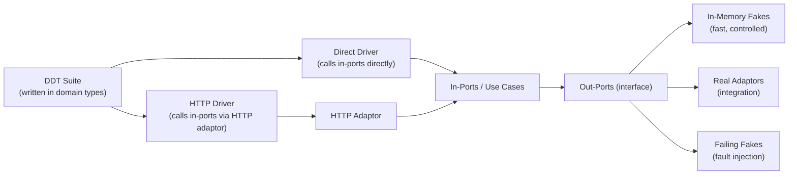

_**Dave Does Architecture** - a series:_

1. [In Defence of Architecture](/posts/2026/7/2/in-defence-of-architecture/)
2. [The Parts of a Ports and Adaptors Application](/posts/2026/7/3/the-parts-of-a-ports-and-adaptors-application/)
3. [Wiring Up a Ports and Adaptors Application](/posts/2026/7/3/wiring-up-a-ports-and-adaptors-application/)
4. How Do You Test an Out-Port? _(coming soon)_
5. **Domain-Driven Tests** - _you are here_
6. Where Does Authentication Go? _(coming soon)_

---

In the [previous post](/drafts/how-do-you-test-an-out-port/) we got a single out-port under test, and - the important bit - a fake implementation of it that behaves _indistinguishably_ from the real thing, guaranteed by a contract test. Now we cash that in. Once you trust the fake, you can drive the _whole_ application on top of it.

### What do I want my out-ports to be?

In production, your out-ports come from `Bootstrap` - the real database, the real services.

In a test you usually don't want to stand all that up. So instead you provide a _different_ implementation of the `OutPorts` interface: one that hands out in-memory fakes for each out-port. As far as the rest of the application is concerned, nothing has changed - it's the same interface, wired up the same way - but now it's fast and easy to control.

The catch, and it's the important bit: the real and fake implementations must be _indistinguishable_ in behaviour. You don't get to hope this is true. You guarantee it with a contract test that runs against both.

Once you trust the fakes, you can drop them into the ordinary production wiring and build the domain on top of them exactly as you would for real - each layer wired the same way, just standing on a faster, more controllable set of out-ports. That's the feature we lean on to build Domain-Driven Tests.

This is the moment to clear up the confusion I promised to come back to. There are interfaces at _both_ edges of the application - the in-ports and the out-ports - and both are there for dependency inversion. But an interface is not the same thing as a _fake boundary_, and only one of the two edges is one:

| Thing | An interface? | What a test does with it |
|---|---|---|
| In-port / use case | yes | **drives from** it - runs the real implementation underneath |
| Out-port | yes | **substitutes** it - the _only_ place we ever swap in a fake |
| Application service | no | nothing - it's internal, and always real |

The in-port is an interface so that something outside - an adaptor, or a test - can _call_ the application without knowing what's behind it. You drive the real thing through it; you never replace it with a fake. The out-port is an interface so that the application can call _out_ without knowing what's behind it - and that's exactly the seam where a test swaps the real thing for a fake. Same language, two completely different jobs. Keep them straight and "the only thing you ever fake is an out-port" stops sounding like a contradiction and starts sounding like the whole point.

### Domain-Driven Tests (DDTs)

A DDT is a test suite written against the in-ports of the application - the use cases - using domain types.[^ddt-refs] It's a poor name, I'll admit. What it really is is a sort of mega-contract wrapped around the whole application: a suite that pins down the _invariants of the application's behaviour_, independent of how you drive it and independent of what's behind the out-ports.

The name is about where the tests are written _from_ - the domain boundary - not about any particular testing religion.

#### Two axes of variation

If the wiring has been done well, you can test the application across two independent axes.

The first is **how you drive the in-ports**: call them directly, with no transport in the way, or call them through an in-adaptor such as HTTP.

The second is **what backs the out-ports**: in-memory fakes (fast, controlled), the real implementations (integration), or deliberately failing fakes (fault injection).

And these combine freely:

| Driver | Out-ports | What you're testing |
|---|---|---|
| Direct | In-memory fakes | Application logic, fast |
| HTTP adaptor | In-memory fakes | HTTP wiring + logic |
| Direct | Real out-ports | Logic + persistence integration |
| HTTP adaptor | Real out-ports | Full stack |
| Direct | Failing fakes | Failure handling |

The same test suite runs across every one of these configurations. The tests don't change - _only what they're wired to_.

#### How DDTs are written

The tests are written in domain types, against the in-port interfaces. In the "unwrapped" configuration they call the use case implementations directly. In the "wrapped" configuration the very same interactions are pushed through a transport adaptor - HTTP, say - which turns them into requests and back again.[^driver-refs]

The consequence is worth dwelling on: your HTTP adaptor tests are _not_ a separate suite fussing over JSON shapes and status codes. They're the _same_ behavioural assertions, run through HTTP. If the adaptor is wired up correctly, the suite passes. If it isn't, it fails in domain terms - not HTTP terms.

The confidence that buys you stacks up nicely. The in-memory out-ports are trusted, because of the contract tests. The wiring is trusted, because the DDT suite passes in the direct configuration. The adaptors are trusted, because the same DDT suite passes in the wrapped configuration. Every layer's correctness is checked by one suite, not by a scattering of disconnected tests that each know a little and trust a lot.

### Fault injection

The contract test only promises the happy path. How the application copes with failures _above_ the adaptor is already covered - that's DDTs with failing fake out-ports, from the table above.

That leaves one gap. You can't reliably provoke a failure _inside_ a real adaptor. You can't make your database throw a connection error on demand - not without some form of remote fault injection, and that's another post.

So to test the adaptor's own error handling, you go underneath it: inject a fake transport - a fake HTTP client, a fake DB driver - into the _real_ adaptor. Now you can make the transport return a 500, a timeout, or a lump of malformed nonsense, and assert on what the adaptor does with it. All in isolation, without needing the real external system to have a bad day on cue. (We saw exactly this move - a stub driven actor behind the real adaptor - back in the [out-port post](/drafts/how-do-you-test-an-out-port/).)

## One suite, every level

Step back and look at what all of this bought. There is one place to fake - the out-ports - and one language to drive in - the in-ports. The same suite of tests means something whether it's running against in-memory fakes in a millisecond or against the real database over real HTTP. Every test, at every level, speaks the application's own language. None of them speak JSON.

That's the whole thing, really. It's why "the only thing you ever fake is an out-port" is worth repeating until it's boring. Get the wiring right and the tests almost write themselves; get it wrong - smear the construction across the codebase, let a use case lean on another use case, mock something in the middle - and no amount of clever testing will buy the confidence back.

And it closes the loop the whole series has been circling. Easy-to-change and easy-to-test are one property seen from two sides. To change a piece safely you take it apart and hold it still; to test it you do exactly the same thing. Buy one and you've bought the other - which is why an architecture built for change hands you its testing strategy nearly for free.

[^ddt-refs]: I didn't invent any of this - I've just given it a name I can remember. If you want it from people who've thought about it harder than I have: Aslak Hellesøy [walks through the idea here](https://www.youtube.com/watch?v=sUclXYMDI94), and Nat Pryce [does the same here](https://www.youtube.com/watch?v=Fk4rCn4YLLU). Both are, sadly, YouTube videos.

[^driver-refs]: The trick underneath this - separating the _test driver_ from the _implementation_ of the test, with a little DSL in the middle so the same tests can run against different bindings - is covered beautifully by Chris James and Riya Dattani [in this talk](https://www.youtube.com/watch?v=ZMWJCk_0WrY), and again, in Go and in writing, by Chris James in [Learn Go with Tests](https://quii.gitbook.io/learn-go-with-tests/testing-fundamentals/working-without-mocks).
