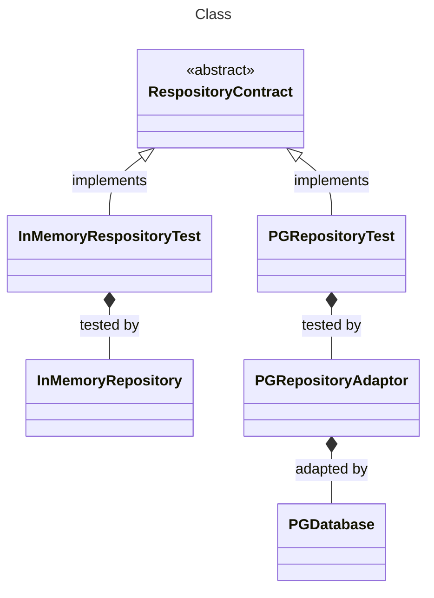
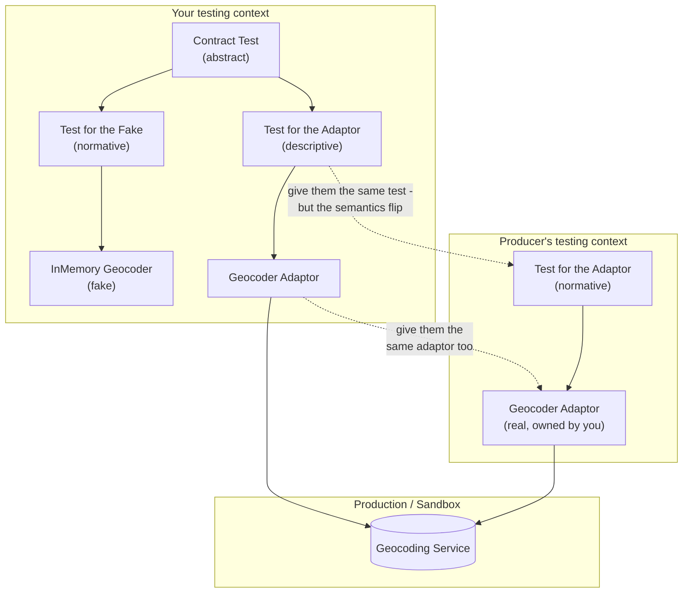

_**Dave Does Architecture** - a series:_

1. [In Defence of Architecture](/posts/2026/7/2/in-defence-of-architecture/)
2. [The Parts of a Ports and Adaptors Application](/posts/2026/7/3/the-parts-of-a-ports-and-adaptors-application/)
3. [Wiring Up a Ports and Adaptors Application](/posts/2026/7/3/wiring-up-a-ports-and-adaptors-application/)
4. **How Do You Test an Out-Port?** - _you are here_
5. Domain-Driven Tests _(coming soon)_
6. Where Does Authentication Go? _(coming soon)_

---

This is the testing companion part of our little series. It leans on the vocabulary from [The Parts of a Ports and Adaptors Application](/posts/2026/7/3/the-parts-of-a-ports-and-adaptors-application/) - ports, adaptors, use cases, out-ports - and on [the wiring](/posts/2026/7/3/wiring-up-a-ports-and-adaptors-application/) that holds them together, so if that's unfamiliar, start there and come back.

Our original post said that in order to make changes easy, you should be able to _see that a change works_. And by work we mean that it does what you wanted it to do, but it also doesn't break anything else. This is that piece. And it turns out to be no accident that the same architecture makes it cheap: the qualities of our architecture that make a system easy to change are also qualities that make it easy to test.

#### Why is it easy to test a "good" architecture?

The property of an architecture that makes it easy to test is - you guessed it - less coupling, more cohesion. A _separation of concerns_, as I've also heard said. By decoupling parts that don't change at the same rate - which _usually_ means isolating the parts of a system that do different "jobs" - it means that when you want to test how an individual behaviour of the system works, you don't need to bring in parts of the system that aren't "concerned" with the behaviour you want to test.

When criticizing object-oriented programming, Joe Armstrong has a fantastic metaphor to do with a banana, a gorilla and a jungle:

> The problem with object-oriented languages is they've got all this implicit environment that they carry around with them. You wanted a banana but what you got was a gorilla holding the banana and the entire jungle.[^2]

Now I think this doesn't perform well as a criticism of object-oriented programming. To me, it's really an excellent description of what happens when design goes wrong. It shows you what goes wrong when programming of any kind gets its coupling and cohesion all wrong. If you can't get the banana without bringing in the whole jungle, then _something is going very wrong with your design and you should feel sad_.

(Of course, sometimes you _do_ want to bring in banana, gorilla, jungle, Old Uncle Tom Cobley and all. This should also be easy to do and we'll see that in some tests. But you shouldn't have to do it to get a banana).

So we can see that testing - asserting on the behaviour of a part of your system - can be a way of seeing if your architecture is working. If you can get a banana quickly and test it, great. If you have to get a gorilla to get a banana, not so great. If you have to build the whole jungle just to look at the banana, panic.

In this way testing gives you fast feedback about your architecture. It can also give you fast feedback about the lower-level design (cough it's just architecture cough) of objects and functions. If it's hard to wrangle an object to test a behaviour of your system, then maybe you need to change the design of the object. Nat Pryce and Steve Freeman have a nice way of expressing this in [_Growing Object Oriented Software, Guided By Tests_](http://www.growing-object-oriented-software.com/)

> Internal quality is what lets us cope with continual and unanticipated change... The point of maintaining internal quality is to allow us to modify the system's behaviour safely and predictably, because it minimizes the risk that a change will force major rework.

and

> Thorough unit testing helps us improve the internal quality because, to be tested, a unit has to be structured to run outside the system in a test fixture.

As I've said, good architecture is all about making it easy to change your system, by decreasing coupling, and increasing cohesion. Unit tests (and all tests are unit tests, because the unit is always of variable size[^unit]) help show you whether you're achieving this. As we want this feedback about our design to be given _before_ we start implementing the design, I also strongly suggest that these tests are all written _before_ you implement the code. That is to say, you should be doing Test-Driven Development. I honestly don't have time or space in this post to explain how to do TDD right [and I should probably make time and space damn it], so go and read Kent Beck and Nat & Steve.

One warning before we begin. What follows is *an* approach to testing a ports and adaptors system, and it's the one that I always reach for. But like everything in this game it is a set of trade-offs, not a law. I'll come to the alternatives, and to where this one costs you, further down.

Testing here is done in terms of ports and adaptors, and it comes down to two questions:

- what do I want my out-ports to be?
- and at which layer am I going to test?

Get those two right and the failure scenarios mostly answer themselves.

### What is it that we test?

I propose that there are three categories of test:

- testing a stateless subject
- testing a stateful subject
- testing with side-effects

In each we are always testing "a thing" - a function, an object, a system - which I will call a subject (and you may sometimes see this referred to as a SUT - which traditionally stands for "system under test" but I prefer "subject under test")[^subject]

#### Testing a stateless subject

Imagine if you will a function that adds two numbers together. It would have a function signature something like this:

```
(a: Int, b: Int) -> Int
```

Marvellous. And we can imagine a set of tests around this. What's nice about this interface and these tests is that we can run them independently of each other.

#### Testing a stateful subject

The distinction that matters is whether the subject's behaviour depends on what you did to it before. A stateful subject changes its behaviour based upon previous interactions; a stateless one doesn't. Add two numbers and you always get the same answer - the call has no history. A collection is different: what you get back depends on what you've already put in and taken out.

Collections interfaces are stateful. If we `put` something into an empty `List`, then we would confidently expect to find it, and that the list would then have a length of `1`. If we take it out, we would expect that the list will return to its original state of emptiness, going back to have a size of `0`.

```
Collection<T>.size() -> Int
Collection<T>.push(item: T) -> Unit
Collection<T>.pop() -> T
```

Anything could implement this interface, quite easily. But just as addition's behaviour is not fully described by the interface of types, so is this collection's behaviour not fully described by the above methods, or even by testing each individual method. To fully capture the behaviour of the subject, we need to test how the subject behaves under different permutations and combinations of the methods in its interface. What if there's nothing in the list to `pop`? Does `pop` give me the last item inserted or the first item inserted? Does it remove the item from the collection? These are behaviours you cannot see in the signature, nor can you see them just by testing individual methods.

#### Testing for side effects

Imagine now an interface that looks like this

```
() -> Unit
```

Wait, what? How does this get tested? Well, let's just remember that _something_ has to change _somewhere_ if your program does something. Even if it's just that the CPU gets a little warmer. So what we'll be doing in this case is looking at the state of a different _thing_ to see that a side-effect has taken place.

Right, that pretty much covers all the tests possible. On to testing something concrete (and kinda abstract) - an out-port.

## Testing an out-port

We're going to start by testing an out-port, starting at the lowest thing on our dependency stack. So how do you test an out-port? It depends on what flavour it comes in. But before I talk about the flavours, I want to ask you a question:

Who owns the world?

OK, OK - not the world. Who owns the thing behind the out-port, the thing that's being adapted to fit?

Sometimes the thing behind the adaptor isn't yours. A payment provider, an identity provider, a geocoder, some other team's service. You still model it as an out-port, and from the application's side nothing changes: it's an interface. A good example would be a `Gateway` as it's sometimes referred to. Sometimes you do own the thing on the other side of the adaptor. Maybe it's a microservice your team owns, maybe it's a database. A good example would be a `Repository`.

Now here's the funny thing: I'm going to tell you to test these two things in exactly the same way (mostly), but the catch is that even though the setup will look the same, (a contract test testing a fake implementation and the real adaptor), the meaning of the tests - their _semantics_ - are quite different. And because of this it will change how you use your tests, and how you respond to test failures.

What do I mean by "semantics" here? I'm going to expand on this by using an example from the "real world".

##### Fitting the world to the test, or fitting the test to the world?

Imagine a man is sent to the supermarket with a shopping list, tasked with buying some items.[^anscombe] And now imagine that someone sent a private investigator to follow him and write down everything he buys. Now both of them have a list of items. And they both relate to the items in the shopping basket. But each list relates to the basket in the opposite way. When the man checks his list and sees that an item on his list is not in the basket, he will go and find the item in the supermarket and put it in the basket. But if the investigator looks at his list and sees that it's missing an item that's in the basket, he will add it to the list. What the detective will _not_ do is go over to the basket and remove the item. Equally, the man will _not_ remove an item from the list if it's not in the basket. Although it may cross his mind...

So the two lists may end up being word-for-word identical to each other, but their semantics remain completely different. For the man the meaning of the list is _normative_ - it says the way the world _ought_ to be, and if the world doesn't live up to the expectations of the shopping list, well, it's up to the man to go and fix the world. Or at least the shopping basket. We say it's a world-to-word fit, the world answers to the words.

Whereas for the investigator the shopping list is _descriptive_. Its meaning is a description of the way the world _is_. So if the list is different to the world, then the investigator will fix the list. It's the inverse - a word-to-world fit, where the words must answer to the world.

> **Normative**: something that says what _ought_ to be. The pictures in Lego building instructions are normative _if you're using it to build some Lego_.
>
> **Descriptive**: something that describes what _is_. A photograph of the Eiffel Tower is descriptive _as long as you're not using it to build the Eiffel Tower_.

And this is the difference between the two sorts of tests we're discussing here. When we own the thing being adapted, our tests are normative. When they fail, we must make changes to things in the world. It is "world-to-test fit" to coin a phrase. Whereas if we're integrating with Stripe, our tests describe how Stripe behaves. It's a "test-to-world fit".

This is muddied slightly by the adaptor; we can genuinely change some behaviours in there - perhaps mapping some of Stripe's error statuses to a custom error code. This is as though the investigator had decided to not write down each of the individual vegetables in the basket, but just wrote "vegetables" instead. In fact, what the investigator has done here is (at least in his head) create a little vocabulary and translation table. And that table is his own private bit of normativity. Which he can control. And change. So that if there's some mismatch between what's in the basket and what's on the list, he can either change the list _or_ change the vocabulary. If everything is a vegetable, then everything fits!

This "coarse" vocabulary makes the description the investigator is writing _vacuous_ - devoid of information and meaning. We've all done this, I'm sure, when we map every single error code from a provider to a generic `StripeError` type. And then we wonder why we can't tell what's broken...

But that still doesn't change the fundamental direction of fit - it's still "word-to-world" or "test-to-world".

So, when I say "semantics" here I mean what the tests say about the interface. And by "behaviour" I mean what the implementation actually does. And the key difference between the Repository out-port and the Gateway out-port is the direction of fit between the two. For the Repository, if the tests fail, you fix the implementation. For the Gateway, if the tests fail, you fix the tests. You don't go and fix Stripe.


#### Repository out-port: you own the adaptee

If you own the semantics of the out-port - if you own and control what goes in and goes out, and how it behaves when you do things over time - then I have good news! This is easy and fun to test. There will be a set of behaviours that you know your out-port needs to implement. If you save a user profile, you can get the user profile back. If we put a file to our object store, we can get that back. If it doesn't exist, it can't come back. If we save it twice... well, actually, that's up to you what happens. But the important thing is that _you decide_. You're in control here.

For this I recommend a _contract test_. This is a way to express the behaviour of your out-port independent of your implementation, independent of the adaptor.

What you start with is an interface - the out-port you want to test. Then you write some tests that exercise that interface and show that it exhibits the behaviour (the semantics) that you want it to. So if it was our user profile we might have some tests that look like this:

```kotlin
@Test
fun `can save a user profile and retrieve it by id`() {
  val userProfileRepository = newUserProfileRepository()
  
  val userId = UserId()
  val userProfile = randomUserProfile(userId)
  
  userProfileRepository.save(userProfile)
  
  val retrievedUserProfile = userProfileRepository.get(userId)
  
  retrievedUserProfile shouldBeEqualTo userProfile
}

```

And we can go on with this sort of test. We utilize the interface of the out-port to assert on the desired behaviour. We assert on the _interface_ of the out-port, and not on the concrete adaptor so that we don't couple our tests to the particular implementation.

Why? There are a few good reasons, not the least of which is that it helps ensure that we're not accidentally coupling our application code with any of the incidental types or behaviour of the implementation. We don't care _how_ our out-port works on the inside, we just care that it does the things we need.

The other benefit is that it opens up the possibility of using the same set of tests against different implementations of the same out-port interface. All one need do is make the tests reusable in some way. In Kotlin/Java land, using JUnit, this is best achieved by making the test class abstract, with the parts that vary - at minimum (and hopefully maximum) the implementation of the out-port - as abstract fields/methods, and the tests as methods on the abstract class. Then you inherit from that base class, getting all the tests, but make sure that your abstract methods/fields are implemented with the out-port implementation you want to test.

This sounds more confusing than it is.

```kotlin
abstract class UserProfileRepositoryContract() {
  abstract fun newUserProfileRepository(): UserProfileRepository
  
  @Test
  fun `can save a user profile and retrieve it by id`() {
    // real test as above
  }
  // more tests
}
```

and then to use it, say against an out-port implementation that used a PostgreSQL adaptor:

```kotlin
class PostgresUserProfileRepositoryTest : UserProfileRepositoryContract() {
  // postgres specific set up stuff - I've seen this done nicely with Testcontainers (https://testcontainers.com/)
  private val postgresDriver = PGDriver(8080, "blahblah")
  
  override fun newUserProfileRepository() = PGUserProfileRepository(postgresDriver)
}
```

And you get all the tests applied to the specific postgres implementation for free! Admittedly 

But why the overhead? Because now I can do something clever and sneaky

```kotlin
class InMemoryUserProfileRepositoryTest : UserProfileRepositoryContract() {  
  override fun newUserProfileRepository() = InMemoryUserProfileRepository()
}
```

I can have the same interface implemented in-memory, and I can assert that it is functionally identical to the PostgreSQL implementation. And if I know that the in-memory version behaves in the same way as the PostgreSQL one, then I can use the in-memory one whenever I like.

This is incredibly liberating for our testing strategy. I can now have tests that can use an in-memory implementation if they depend on a `UserProfileRepository`, and be confident that our fake behaves in exactly the same way as the real thing, guaranteed by the contract.

I like to think of it as some sort of transitive confidence property. If RealA acts like C, and FakeA acts like C, then whenever I need a C I can use a FakeA, and be sure that it will work just like the RealA for the purposes of the test. The only time I actually need the RealA is in production.

##### Yes but... failure

This is all well and good for when everything is going to plan - the "happy path" as we say. But what of the "sad path"? Don't we need to see how the adaptor behaves when PostgreSQL blows up? This is a hard thing to test in the adaptor against the real PostgreSQL implementation because it's very difficult to make a real implementation error on demand (although there are ways, and we can see them later).

In addition, you _don't_ need to be testing the failure mode of your fake implementation of the same out-port, because it shouldn't fail. Or, at least, it shouldn't be failing in the same way.

My preferred way of testing the failure behaviours of the adaptor is to inject a different type of test double - a stub - as a dependency into the adaptor to replace the "driven actor" - the real dependency that the adaptor wraps.[^1] This particular flavour of stub has a proper name: Gerard Meszaros calls a stub that exists purely to raise errors a [_Saboteur_](http://xunitpatterns.com/Test%20Stub.html), as against a _Responder_, which feeds the happy path. What we want here is a Saboteur. Something like this:

```kotlin
@Test
fun `returns a failure if the database connection throws during the operation`() {
  val saboteurDriver = SaboteurPGDriver() // a PGDriver that only knows how to fail
  
  val repository = PGUserProfileRepository(saboteurDriver)
  
  val result = repository.save(randomUserProfile())
  
  result shouldBe aFailure
}
```

Your interface might signal failures by throwing errors, or a second return value (like in Go), or using some sort of `Result` or `Either` type. Either way, you should test how you translate failures in the underlying implementation into the semantics of the out-port you've designed.

If we were to draw a picture of the relationships between what behaviours a set of tests is testing, and which subjects they test, it could look like this:





In all of the above cases, the tests are mostly _normative_. I say mostly as there may be behaviours in the PostgreSQL implementation that you can't change in the Postgres Repository (the adaptor), in which case you may need to change your out-port interface, and consequently the tests, to fit with that limitation. It's a bit of the world you _can't_ change. In those cases, the tests of the Postgres Repository are _descriptive_. But the fake repository's tests are _always_ normative, because you're trying to achieve there is a _copy_ of the _description_ of the real implementation.

Now let's see what happens with our other scenario, where another team owns the adaptee.

#### Gateway out-port: someone else owns the adaptee

In this situation, the adapted thing (the adaptee) is owned by an external team. And my recommendation is the same - write a contract, implement an in memory fake, implement the real adaptor, test them both.

But, as I warned right at the beginning, the semantics here are different.

Now if it's just you running the test against the real service, you're setting yourself up for some trouble. At any moment the provider can change the behaviour of the system that you're reliant on, and your app will break. I hope you see the connection to the abstract stuff I was waffling on about earlier. For _you_ the test you have written is _descriptive_ of the behaviour of the provider. And that's not going to be enough to catch their changes as they make them. The provider may not know that they've broken anything for you. In fact, they may think they're fixing something - maybe a typo - that you're relying on in some way that they're blind to. This won't be caught by any of your tests immediately as none of your code will change at the time they make their change, so none of your local or pipeline tests will run. What you want, ideally, is for the provider to run that test when _they_ make changes, for it to be a part of their pipeline.

What we need to do is flip the semantics of the test by changing who is "holding" it. It's the same shopping list, but we want to hand it over to the guy with the basket, and not the investigator who's watching him. We want to make the same set of tests _normative_ for the provider.

There's a name for performing this semantic flip: a _Consumer-Driven Contract_. The idea goes right back to [Ian Robinson's original write-up](https://martinfowler.com/articles/consumerDrivenContracts.html) in 2006, and - this is the bit worth holding on to - it was all about _tests_ from the very start: the consumer's expectations expressed as assertions the provider runs against its own real implementation. The contract _is the test_ - the very same contract test we just wrote, that abstract class defining the out-port's semantics. You hand _that test_ to the producer, along with your adaptor, and they run it against their _real_ implementation, in _their_ pipeline. You run the identical test against your fake, in yours. So now the day their real service stops behaving the way your fake does, it's _their_ build that goes red - because it's _your_ test that catches it.[^cdc] 

And as if by magic, we have the one test (the single shopping list) that is both _descriptive_ of the producer in your context and _normative_ to the producer in their context, allowing them to ship changes without breaking their contract with you. But within the context of your system, the same test applied to the in-memory fake is, in fact, _normative_ , because if the tests fail you'll need to update the fake.



The catch is the one every cross-team handshake has: the producer has to actually run your test. For an internal service owned by the team down the hall - brilliant, do exactly this. Really easy in a monorepo, but still doable if you have _some way_ to share code. For a true third party who's never heard of you (Stripe is not going to run your test suite, no matter how much you ask), you're back to relying on their system, and to the discipline of re-running against them often enough to catch the drift yourself. And there's nothing wrong with this. Continue to use the same test for the adaptor of the producer, continue to run it as is locally and in your pipeline. It's an _integration test_ now, checking that you've described the API of the real producer accurately. So the exact same test, running in your context, is now _descriptive_.

And actually, that descriptive test is useful as it offers the guarantee that the behaviour it describes for the producer is the same behaviour that your fake implementation must have. The test-to-world fit becomes a world-to-test fit. Just as though, in order to buy the same things as someone else, you have written a shopping list by looking at what's in their basket, and then afterwards you use the self-same list to go shopping with, and use it to fill your basket. The descriptive list becomes a normative list, just as our descriptive test in one place works as a normative test in another.

The one thing that always spoils this is wobbly state lurking in the producer: leftover data, other people's test runs, rate-limit windows - anything that means the same call doesn't give the same answer twice. You also have the issue of using a real production system; every time you run a test you could be paying for the API usage. Some providers will offer a sandbox environment to help mitigate some of these issues with state and cost. If the sandbox is clean and deterministic, the contract holds and your fake stays honest against it. If it isn't, the contract can't promise indistinguishability there, and you're back to crossing your fingers.

#####  (Mostly) Stateless

On a small positive note, it's worth mentioning that a lot of these external services are, for the intents and purposes of your application, completely stateless. It may well be that the contents of the Geocoder service changes over time, but it's more than likely that your application won't consider that an issue - it is happy with whatever the result is right now, and cannot affect that by, say, posting to the service. For you, it's read only.

Which is to say that, a lot of the time, you really only care about the _shape_ of the data coming back, and not how it changes over time. So you may decide that all of the above is a little overkill, and what you really want to do is to assert that the _shape_ of the response you're ready to adapt in the adaptor (including error states) is the same as the _shape_ that's being emitted from the provider. While this can be achieved with the above approach, you may be better off just asserting against some schematic description of the provider's payload, such as OpenAPI documentation. If you have a test that shows that your adaptor can work with permutations of data produced in conformance to the schema published by the provider, then you may decide that this gives you enough confidence that the same adaptor will work in production.

This of course relies on the schema published by the provider being accurate. Which may not always be the case.

#### Side-effecting out-port: fire-and-forget

Remember the `() -> Unit` puzzle from before? This is where it lives. Sending an email, firing off an SMS, publishing an event onto a queue - the out-port takes a domain value and returns nothing you care about. `send(email): Unit`.

You test it exactly the way we said you test any side-effect: by looking at the state of a _different_ thing. And there are two different "things" you can look at, giving two different tests.

The first is to **spy on the driven actor** - the thing the adaptor wraps. Inject a fake transport (a fake SMTP client, a fake queue publisher) into the _real_ adaptor, and afterwards ask it what it was told to do: was it handed an email to _this_ address, with _this_ body? This is the same move we used for failure injection, just pointed at the happy path - you're asserting the adaptor _translated the call correctly_, that a `send(email)` turned into the right instruction to the transport.

The second is to **find the thing that gets affected, and assert on that** - go and look at the real outcome, out in the world. A test mailbox that actually received the mail, a queue you drain and inspect. That's an _integration test_: slow, networked, real, and the only thing that proves the whole adaptor-plus-transport chain genuinely does the deed.

Now here's the important bit, and it's what makes side-effects the odd one out. **You cannot contract these against each other the way you could the repository or the gateway.** With a repository, the fake and the real both answer the _same_ question through the _same_ interface - you write, you read back, you compare - so one contract test can pin them both. A side-effecting out-port returns `Unit`. There is nothing to read back through the interface. So the fake is checked one way (a spy on its recording) and the real is checked a completely different way (an effect observed somewhere downstream), and the two verifications never meet at the interface. There's no shared contract to guarantee they're indistinguishable, because the interface itself hands you nothing to compare. The best you can do is: trust the spy for the fast tests, and keep a handful of downstream integration tests to prove the real adaptor actually fires. Two separate assurances, held together by nothing but your own discipline.

##### Sneaky out-box pattern trick

"But Dave," you say, "I can work around this with the out-box pattern", and yes indeed you can.  For those who don't know, the out-box pattern is a way of decoupling the intention of doing an action from the act of doing it. It's often used for executing an asynchronous task as a side-effect - like sending an email - without interrupting the flow of some process.

In short, you take the "thing being sent" and put it in a persistent queue - probably in a database. This is the "out box". Then another asynchronous worker, running in the background, will regularly look at the queue, see if there's anything to send, send it, then mark it as sent (either tick it off or delete it). This means that the worker can handle all the retry and failure logic for the task, and the main process just knows that it's (probably) been taken care of. It's very good for handling side effects.

So if we assert on the out-box, we're fine, right? That has a observable effect (things go in, things can be read out) and other behaviours, so now we're saved from having to test something with a side-effect.

Alas, no. All we've done is just kicked the can down the road a little. You do then still need to write a test around the "sender" worker, to check its behaviour (how many times it retries, etc). And _that_ will need to be tested with some sort of spy representing the "real" out-port interface to the, for example, email client.

[is this accurate???]

#### The ambient ones: clock and id

Two out-ports you might not think of as out-ports: the clock (`now(): Instant`) and whatever mints your ids. They do no I/O worth speaking of, so why hide them behind a port at all? _Determinism_. Fake the clock and "expires in 30 days" becomes a test you can write without waiting a month; fix the id generator and your assertions stop chasing random UUIDs. Same seam as always, different reason for it: not to dodge a database, but to nail down the two most annoying sources of nondeterminism in your tests.

(Loggers and metrics are out-ports too, technically - sinks to the outside world - but I don't bother contract-testing them. Nobody writes a DDT (domain-driven test - that's the next post) about a log line. Wire them up, ignore them, move on.)

[^1]: the Gang of Four book would say that the thing that gets adapted is properly called the adaptee, but that word is just too much like hard work.
[^2]: Quoted in [_Coders at Work_](https://codersatwork.com/) by Peter Seibel
[^cdc]: I'm reclaiming "Consumer-Driven Contract" from the tools that colonized it - though really I'm just pointing back at [the original](https://martinfowler.com/articles/consumerDrivenContracts.html) (Ian Robinson, 2006), which framed a consumer's expectations as executable assertions the provider verifies against its own output. The honest version isn't a serialized file of request/response pairs traded between teams - it's the _same contract test_, authored by the consumer, run in two places: against the fake in your build, and against the real implementation in the producer's. One test, held to on both sides of the boundary. The popular tooling will sell you a thinner thing; you don't have to buy it.
[^unit]: I always feel like the parable of the good Samaritan is coming on here, expecting someone in the crowd to ask me "but Dave, who is my neighbour? Sorry, I mean - what is my Unit"? I'll leave this as a footnote, but my opinion (aligning with that Ian Cooper talk you've probably all seen) is that a unit is anything that exhibits _cohesive behaviour_ with _observable outcomes_. So everything from whole system tests, yea even those that test more than one system, all the way down to testing single functions, they are all "unit" tests. With the small proviso that, as far as the "feels" go, anything that's testing the UI interactions and lots of HTTP doesn't really feel "unit-y".
[^anscombe]: The example is almost word to word from G. E. M. Anscombe, *Intention* (1957), §32; the label "direction of fit" comes later, via Austin, standardized by Searle in *Expression and Meaning* (1979). The original Anscombe example (which is funnier) can be read [here](https://plato.stanford.edu/archives/win2018/entries/anscombe/#:~:text=Let%20us%20consider,record.%20(section%2032).)
[^subject]: I prefer to say "subject" rather than "system" because when people hear "system" they immediately think big in their heads. The system can be anything from a function to a server, but people tend not to think of a function as a system. So - subject.
