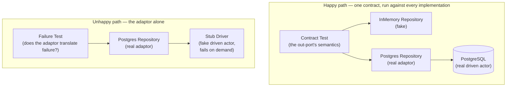
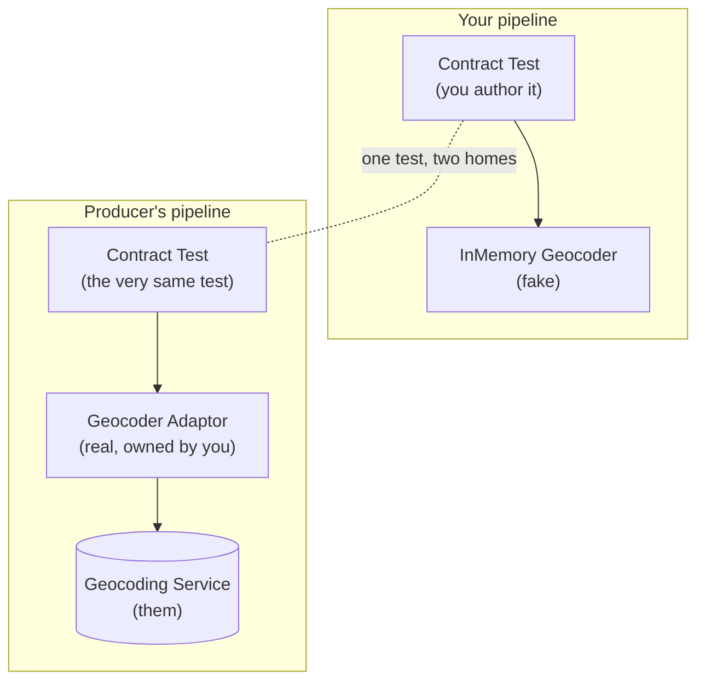
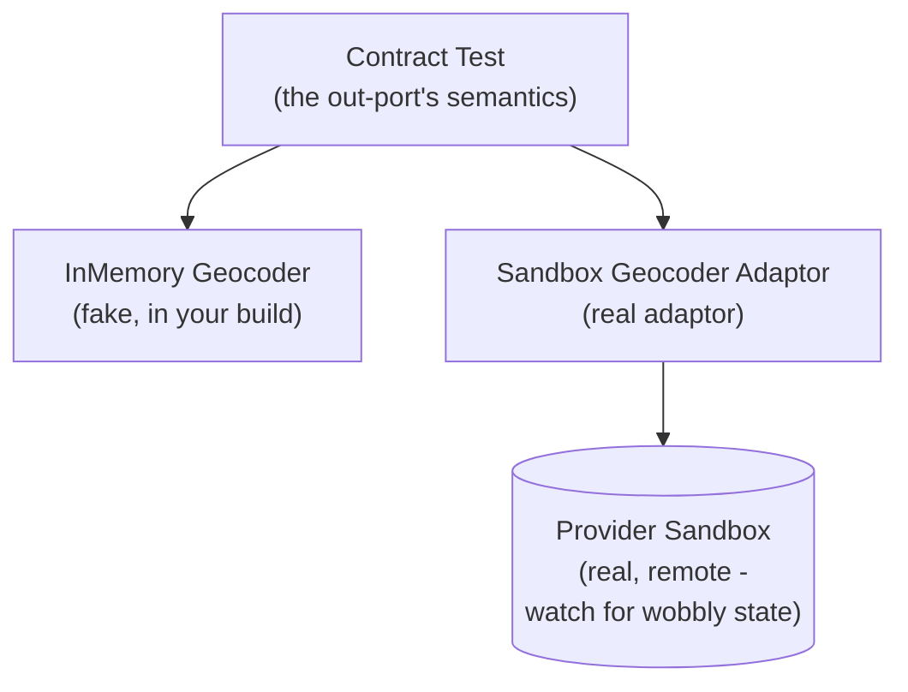

_**Dave Does Architecture** - a series:_

1. [In Defence of Architecture](/posts/2026/7/2/in-defence-of-architecture/)
2. [The Parts of a Ports and Adaptors Application](/posts/2026/7/3/the-parts-of-a-ports-and-adaptors-application/)
3. [Wiring Up a Ports and Adaptors Application](/posts/2026/7/3/wiring-up-a-ports-and-adaptors-application/)
4. **How Do You Test an Out-Port?** - _you are here_
5. Domain-Driven Tests _(coming soon)_
6. Where Does Authentication Go? _(coming soon)_

---

This is the testing companion part of our little series. It leans on the vocabulary from there - ports, adaptors, use cases, out-ports, and the wiring that holds them together - so if that's unfamiliar, start there and come back.

Our original post said that in order to make changes easy, you should be able to _see that a change works_. And by work we mean that it does what you wanted it to do, but it also doesn't break anything else. This is that piece. And it turns out to be no accident that the same architecture makes it cheap: the qualities of our architecture that make a system easy to change are also qualities that make it easy to test.

#### Why is it easy to test a "good" architecture?

The property of an architecture that makes it easy to test is - you guessed it - less coupling, more cohesion. A _separation of concerns_, as I've also heard said. By decoupling parts that don't change at the same rate - which _usually_ means isolating the parts of  a system that do different "jobs" - it means that when you want to test how an individual behaviour of the system works, you don't need to bring in parts of the system that aren't "concerned" with the behaviour you want to test.

When criticizing object-oriented programming, Joe Armstrong [check it's him] has a fantastic metaphor to do with a banana, a gorilla and a jungle:

> The problem with object-oriented languages is they've got all this implicit environment that they carry around with them. You wanted a banana but what you got was a gorilla holding the banana and the entire jungle.[^2]

Now I think this doesn't perform well as a criticism of object-oriented programming. To me, it's really an excellent description of what happens when design goes wrong. It shows you what goes wrong when programming of any kind gets its coupling and cohesion all wrong. If you can't get the banana without bringing in the whole jungle, then _something is going very wrong with your design and you should feel sad_.

(Of course, sometimes you _do_ want to bring in banana, gorilla, jungle, Old Uncle Tom Cobley and all. This should also be easy to do and we'll see that in some tests. But you should't have to do it to get a banana).

So we can see that testing - asserting on the behaviour of a part of your system - can be a way of seeing if your architecture is working. If you can get a banana quickly and test it, great. If you have to get a gorilla to get a banana, not so great. If you have to build the whole jungle just to look at the banana, panic.

In this way testing gives you fast feedback about your architecture. It can also give you fast feedback about the lower-level design (cough it's just architecture cough) of objects and functions. If it's hard to wrangle an object to test a behaviour of your system, then maybe you need to change the design of the object. Nat Pryce and Steve Freeman have a nice way of expressing this in _Growing Object Oriented Systems, Guided By Tests_

> Internal quality is what lets us cope with continual and unanticipated change... The point of maintaining internal quality is to allow us to modify the system's behaviour safely and predictably, because it minimizes the risk that a change will force major rework.

and

> Thorough unit testing helps us improve the internal quality because, to be tested, a unit has to be structured to run outside the system in a test fixture.

As I've said, good architecture is all about making it easy to change your system, by decreasing coupling, and increasing cohesion. Unit tests (and all tests are unit tests, because the unit is always of variable size [I should probably explain this more either earlier or later]) help show you whether you're achieving this. As we want this feedback about our design to be given _before_ we start implementing the design, I also strongly suggest that these tests are all written _before_ you implement the code. That is to say, you should be doing Test-Driven Development. I honestly don't have time or space in this post to explain how to do TDD right [and I should probably make time and space damn it], so go and read Kent Beck and Nat & Steve.

One warning before we begin. What follows is *an* approach to testing a ports and adaptors system, and it's the one that I always reach for. But like everything in this game it is a set of trade-offs, not a law. I'll come to the alternatives, and to where this one costs you, further down.

Testing here is done in terms of ports and adaptors, and it comes down to two questions:

- what do I want my out-ports to be?
- and at which layer am I going to test?

Get those two right and the failure scenarios mostly answer themselves.

### What is it that we test?

I propose that there are three categories of test:

- testing a stateless subject
- testing a stateful subject
- testing with side-effects

In each we are always testing "a thing" - a function, an object, a system - which I will call a subject (and you may sometimes see this referred to as a SUT - "subject under test")

#### Testing a stateless subject

Imagine if you will a function that adds two numbers together. It would have a function signature something like this:

```
(a: Int, b: Int) -> Int
```

Marvellous. And we can imagine a set of tests around this. What's nice about this interface and these tests is that we can run them in independently of each other.

#### Testing a stateful subject

The distinction that matters is whether the subject's behaviour depends on what you did to it before. A stateful subject changes its behaviour based upon previous interactions; a stateless one doesn't. Add two numbers and you always get the same answer - the call has no history. A collection is different: what you get back depends on what you've already put in and taken out.

Collections interfaces are stateful. If we `put` something into an empty `List`, then we would confidently expect to find it, and that the list would then have a length of `1`. If we take it out, we would expect that the list will return to its original state of emptiness, going back to have a size of `0`.

```
Collection<T>.size() -> Int
Collection<T>.push(item: T) -> Unit
Collection<T>.pop() -> T
```

Anything could implement this interface, quite easily. But just as addition's behaviour is not fully described by the interface of types, so is this collection's behaviour not fully described by the above methods.

#### Testing for side effects

Imagine now an interface that looks like this

```
() -> Unit
```

Wait, what? How does this get tested? Well, let's just remember that _something_ has to change _somewhere_ if your program does something. Even if it's just that the CPU gets a little warmer. So what we'll be doing in this case is using looking at the state of a different _thing_ to see that a side-effect has taken place.

Right, that pretty much covers all the tests possible. On to testing something concrete (and kinda abstract) - an out-port.

## Testing an out-port

We're going to start by testing an out-port, starting at the lowest thing on our dependency stack. So how do you test an out-port? It depends on what flavour it comes in.

#### Stateful out-port: the repository

If you own the semantics of the out-port - if you own and control what goes in and goes out, and how it behaves when you do things over time - then I have good news! This is easy and fun to test. There will be a set of behaviours that you know your out-port needs to implement. If you save a user profile, you can get the user profile back. If we put a file to our object store, we can get that back. If it doesn't exist, it can't come back. If we save it twice... well, actually, that's up to you what happens. But the important thing is that _you decide_. You're in control here.

For this I recommend a _contract test_. This is a way to express the behaviour of you out-port independent of your implementation, independent of the adaptor.

What you start with is an interface - the out-port you want to test. Then you write some tests that exercise that interface and show that it exhibits the behaviour (the semantics) that you want it to. So if it was our user profile we might have some tests that look like this:

```kotlin
@Test
fun `can save a user profile and retrieve it by id`() {
  val userProfileRepository = newUserProfileRepository()
  
  val userId = UserId()
  val userProfile = randomUserProfile(userId)
  
  userProfileRepository.save(userProfile)
  
  val retrievedUserProfile = userProfileRepository.get(userId)
  
  retrievedUserProfile shouldBeEqualTo userProfile
}

```

And we can go on with this sort of test. We utilize the interface of the out-port to assert on the desired behaviour. We assert on the _interface_ of the out-port, and not on the concrete adaptor so that we don't couple our tests to the particular implementation.

Why? There are a few good reasons, not the least of which is that it helps ensure that we're not accidentally coupling out application code with any of the incidental types or behaviour of the implementation. We don't care _how_ our out-port works on the inside, we just care that it does the things we need.

The other benefit is that it opens up the possibility of using the same set of tests against different implementations of the same out-port interface. All one need do is make the tests reusable in some way. In Kotlin/Java land, using JUnit, this is best achieved by making the test class abstract, with the parts that vary - at minimum (and hopefully maximum) the implementation of the out-port - as abstract fields/methods, and the tests as methods on the abstract class. Then you inherit from that base class, getting all the tests, but make sure that your abstract methods/fields are implemented with the out-port implementation you want to test.

This sounds more confusing than it is.

```kotlin
abstract class UserProfileRepositoryContract() {
  abstract fun newUserProfileRepository(): UserProfileRepository
  
  @Test
  fun `can save a user profile and retrieve it by id`() {
    // real test as above
  }
  // more tests
}
```

and then to use it, say against an out-port implementation that used a PostgreSQL adaptor:

```kotlin
class PostgresUserProfileRepositoryTest : UserProfileRepositoryContract() {
  // postgres specific set up stuff - I've seen this done nicely with test containers
  private val postgresDriver = PGDriver(8080, "blahblah")
  
  override fun newUserProfileRepository() = PGUserProfileRepository(postgresDriver)
}
```

And you get all the tests applied to the specific postgres implementation for free! Admittedly 

But why the overhead? Because now I can do something clever and sneaky

```kotlin
class InMemoryUserProfileRepositoryTest : UserProfileRepositoryContract() {  
  override fun newUserProfileRepository() = InMemoryUserProfileRepository()
}
```

I can have the same interface implemented in-memory, and I can assert that it is functionally identical to the PostgreSQL implementation. And if I know that the in-memory version behaves in the same way as the PostgreSQL one, then I can use the in-memory one whenever I like.

This is incredibly liberating for our testing strategy. I can now have tests that can use an in-memory implementation if they depend on a `UserProfileRepository`, and be confident that our fake behaves in exactly the same way as the real thing, guaranteed by the contract.

I like to think of it as some sort of transitive confidence property. If RealA acts like C, and FakeA acts like C, then whenever I need a C I can use a FakeA, and be sure that it will work just like the RealA for the purposes of the testing or whatever. Really the only time I need to use the RealA is in production

##### Yes but... failure

This is all well and good for when everything is going to plan - the "happy path" as we say. But what of the "sad path" - don't we need to see how the adaptor behaves when PostgreSQL blows up? This is a hard thing to test in the adaptor against the real PostgreSQL implementation because it's very difficult to make a real implementation error on demand (although there are ways, and we can see them later).

In addition, you _don't_ need to be testing the failure mode of your fake implementation of the same out-port, because it shouldn't fail. Or, at least, it shouldn't be failing in the same way.

My preferred way of testing the failure behaviours of the adaptor is to inject a different type of test double - a stub - as a dependency into the adaptor to replace the "driven actor" - the real dependency that the adaptor wraps.[^1] Something like this:

```kotlin
@Test
fun `returns a failure if the database connection throws during the operation`() {
  val stubPGDriverThatThrows = StubPGDriverThatThrows()
  
  val repository = PGUserProfileRepository(stubPGDriverThatThrows)
  
  val result = repository.save(randomUserProfile())
  
  result shouldBe aFailure
}
```

Your interface might signal failures by throwing errors, or a second return value (like in Go), or using some sort of `Result` or `Either` type. Either way, you should test how you translate failures in the underlying implementation into the semantics of the out-port you've designed.

If we were to draw a picture of the relationships between what behaviours a set of tests is testing, and which subjects they test, it could look like this:



#### Gateway out-port: someone else owns the semantics

Sometimes the thing behind the out-port isn't yours. A payment provider, an identity provider, a geocoder, some other team's service. You still model it as an out-port - `PaymentGateway`, `Geocoder` - and from the application's side nothing changes: it's an interface, and you fake it.

The catch is the contract. With the repository you _defined_ the semantics, so the contract test was just you writing down your own rules. Here you _don't_ own them - the third party does - and your fake is only a guess about how they behave. If the guess is wrong, your fake and your tests will agree with each other perfectly, all the way up until production breaks.

So the contract test has to run against the _real_ thing too - their sandbox, their staging endpoint, a recorded set of real responses - and not just your fake. That's the only way the "indistinguishable" guarantee means anything here, because the behaviour you're trying to match is precisely the one you don't control. It'll be slower, flakier, and rate-limited, so you'll run it far less often than your fast fakes - but run it you must, or your fake and reality will quietly drift apart.

There's a name for this, for when the other side will play along: a _Consumer-Driven Contract_. And the real version of it is far better than the one you've probably been sold. The contract _is the test_ - the very same contract test we just wrote, that abstract class pinning the out-port's semantics. You hand _that test_ to the producer, and they run it against their _real_ implementation, in _their_ pipeline. You run the identical test against your fake, in yours. Two greens, one test: the day their real service stops behaving the way your fake does, it's _their_ build that goes red - because it's _your_ behavioural test that catches it.[^cdc]

That's a world away from the anaemic thing the tooling has reduced "CDC" to - a serialized bundle of canned requests and expected responses, shipped between teams. That's a shadow of the idea. The real article is your _actual test_, the one already guarding your fake, running against their real thing. Same test, two homes; the fake and the real held to a single standard on both sides of the boundary.



The catch is the one every cross-team handshake has: the producer has to actually run your test. For an internal service owned by the team down the hall - brilliant, do exactly this. Even easier in a monorepo, but still doable if you have _some way_ to share code. For a true third party who's never heard of you (Stripe is not going to run your test suite, no matter how much you ask), you're back to relying on their system, and to the discipline of re-running against them often enough to catch the drift yourself. If the provider is big enough they've probably got a sandbox environment.

But even then you needn't give up the one-test idea. Point the _same_ contract test at their sandbox, as just another implementation of the out-port - a `SandboxGeocoderTest : GeocoderContract` sitting right next to your fake. It's an _integration test_ now - slow, networked, hitting a real system you don't own - but it's the identical suite, asserting the identical semantics. The one thing that spoils it is wobbly state lurking in the sandbox: leftover data, other people's test runs, rate-limit windows - anything that means the same call doesn't give the same answer twice. If the sandbox is clean and deterministic, the contract holds and your fake stays honest against it. If it isn't, the contract can't promise indistinguishability there, and you're back to recorded responses and crossed fingers.



Note that these are often query-shaped (`address -> Coordinates`), so the tests _look_ like the stateless case from earlier. The difference isn't the shape, it's the ownership.

#### Side-effecting out-port: fire-and-forget

Remember the `() -> Unit` puzzle from before? This is where it lives. Sending an email, firing off an SMS, publishing an event onto a queue - the out-port takes a domain value and returns nothing you care about. `send(email): Unit`.

You test it exactly the way we said you test any side-effect: by looking at the state of a _different_ thing. And there are two different "things" you can look at, giving two different tests.

The first is to **spy on the driven actor** - the thing the adaptor wraps. Inject a fake transport (a fake SMTP client, a fake queue publisher) into the _real_ adaptor, and afterwards ask it what it was told to do: was it handed an email to _this_ address, with _this_ body? This is the same move we used for failure injection, just pointed at the happy path - you're asserting the adaptor _translated the call correctly_, that a `send(email)` turned into the right instruction to the transport.

The second is to **find the thing that gets effected, and assert on that** - go and look at the real outcome, out in the world. A test mailbox that actually received the mail, a queue you drain and inspect. That's an _integration test_: slow, networked, real, and the only thing that proves the whole adaptor-plus-transport chain genuinely does the deed.

Now here's the important bit, and it's what makes side-effects the odd one out. **You cannot contract these against each other the way you could the repository or the gateway.** With a repository, the fake and the real both answer the _same_ question through the _same_ interface - you write, you read back, you compare - so one contract test can pin them both. A side-effecting out-port returns `Unit`. There is nothing to read back through the interface. So the fake is checked one way (a spy on its recording) and the real is checked a completely different way (an effect observed somewhere downstream), and the two verifications never meet at the interface. There's no shared contract to guarantee they're indistinguishable, because the interface itself hands you nothing to compare. The best you can do is: trust the spy for the fast tests, and keep a handful of downstream integration tests to prove the real adaptor actually fires. Two separate assurances, held together by nothing but your own discipline.

#### The ambient ones: clock and id

Two out-ports you might not think of as out-ports: the clock (`now(): Instant`) and whatever mints your ids. They do no I/O worth speaking of, so why hide them behind a port at all? _Determinism_. Fake the clock and "expires in 30 days" becomes a test you can write without waiting a month; fix the id generator and your assertions stop chasing random UUIDs. Same seam as always, different reason for it: not to dodge a database, but to nail down the two most annoying sources of nondeterminism in your tests.

(Loggers and metrics are out-ports too, technically - sinks to the outside world - but I don't bother contract-testing them. Nobody writes a DDT about a log line. Wire them up, ignore them, move on.)

[^1]: the Gang of Four book would say that the thing that gets adapted is properly called the adaptee, but that word is just too much like hard work.
[^2]: Quoted in _Coders at Work_ by Peter Siebel
[^cdc]: I'm reclaiming "Consumer-Driven Contract" from the tools that colonized it. The honest version isn't a serialized file of request/response pairs traded between teams - it's the _same contract test_, authored by the consumer, run in two places: against the fake in your build, and against the real implementation in the producer's. One test, held to on both sides of the boundary. The popular tooling will sell you a thinner thing; you don't have to buy it.
