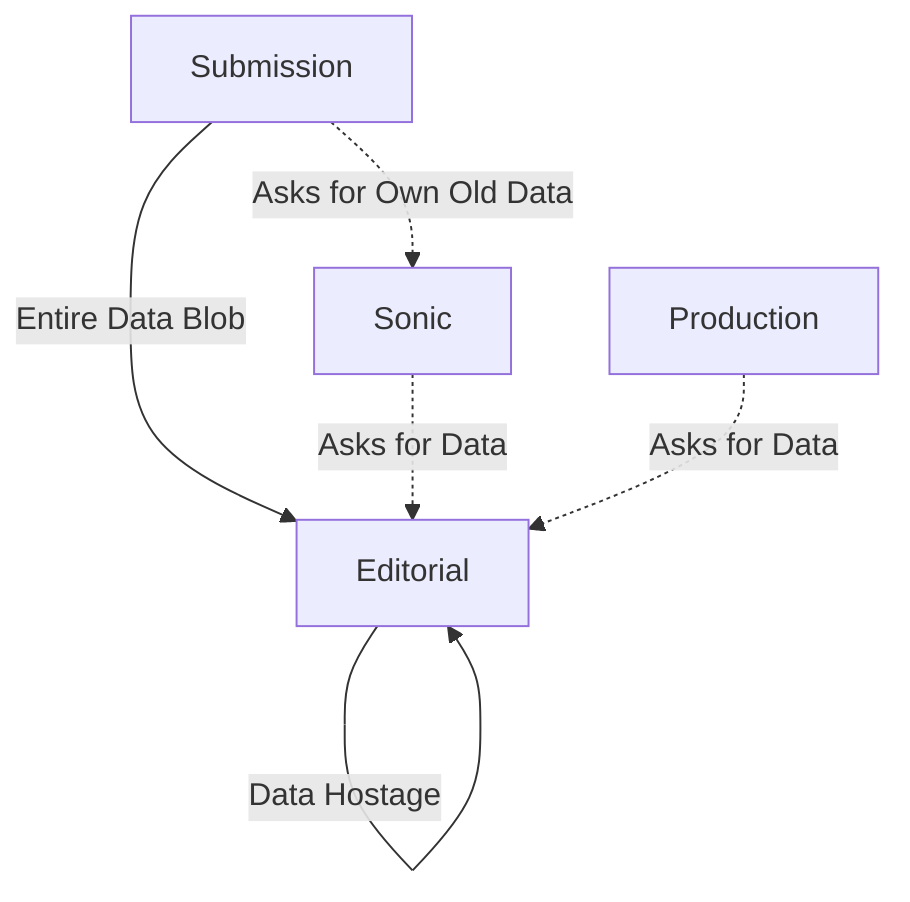

##### Breaking Free
# Fixing Our Architecture
	Moving Faster by Decoupling Data from Process

Our Editorial system has become an accidental data hoarder. This is the plan to untangle the knot and get back to building features quickly and safely.

---
### The Problem
	Every System Depends on Editorial

	We have a bottleneck. Our Editorial system owns data it doesn't need, and everyone else has to ask for it back.

This tight coupling makes every change slow and risky. A simple data update ripples across the entire ecosystem.

---
## The Research
	Event Storming Revealed the Truth

We ran event storming sessions with multiple SNAPP teams to map out how operations actually flow through our system. The results were eye-opening. MAYBE SHARE THEM???

---
### What We Discovered
	A Clear Bounded Context Violation

	**The Finding:** Draft submission operations form a natural unity - a "bounded context" in DDD terms. But our architecture breaks this boundary repeatedly.

The Submission system has to ask other systems for data it should own and control.

---
### The Smoking Gun
	Submission System Asking for Its Own Data

	**Example:** The Submission system asks Editorial for the title of a submission.

But think about this: *who else can change that title?* Only the Submission system itself. Yet it has to go through Editorial to get its own data back.

This is a fundamental boundary violation. The system that controls the lifecycle of data shouldn't need to ask another system for it.

---
## The Current Mess
	Editorial as Accidental Data Store

The Submission system even has to ask Editorial for its own historical data through Sonic. That's backwards.

---
### What's Wrong Here?
	We've Mixed Two Different Things

	**Submission Data:** The science itself - changes when authors revise
	**Review Data:** The review process - changes when editors take action

These change for different reasons, interest different people, but we've tied them together. This makes it impossible to evolve each independently.

---
### Domain-Driven Design Says...
	Respect the Bounded Context

	**Core Principle:** Each bounded context should own its data and lifecycle completely.

The event storming sessions showed us that draft submissions have their own clear operational boundaries. Our current architecture violates these natural boundaries by scattering ownership across systems.

When a system has to ask another system for data it should control, you've broken the bounded context. This creates the coupling that's slowing us down.

---
## What is a Bounded Context?
	Think of it Like a Kitchen

Imagine your kitchen at home. Everything you need to cook is there: ingredients, tools, recipes. You don't have to ask your neighbor for salt or run to the garage for a pan.

	**A bounded context is like a well-organized kitchen - everything needed for a specific job is in one place, under one management.**

Now imagine if your salt was stored in your neighbor's house. Every time you cook, you'd have to ask them for it. That's what's happening with our submission data.

---
### The Submission System Should Be Like This Kitchen
	Self-Contained and Self-Sufficient

The event storming revealed that submission operations form a natural unity. Just like a kitchen has everything needed for cooking, the submission system should have everything needed for managing author data.

	**Right now, our "kitchen" has to ask other "houses" for its own ingredients.**

This violates the natural boundary that the research showed us exists.

---
## Three Guiding Principles
	How to Fix Our Architecture

Based on the bounded context research, here are the principles that should guide all our development work:

---
### 1. Well-Encapsulated Unity
	The Submission System Should Be Complete

	**Principle:** The submission system should be a self-contained, well-organized "kitchen" for all author data operations.

Everything needed to manage submission data should be within this boundary. No essential pieces scattered elsewhere.

---
### 2. Single Source of Responsibility
	Only the Submission System Changes Author Data

	**Principle:** The submission system should be responsible for author-provided data. It should be the only place that changes it.

Just like only the cook should manage what's in their kitchen, only the submission system should modify submission data. Other systems can read it, but they don't change it.

---
### 3. Never Ask for Your Own Data
	Other Systems Come to You

	**Principle:** The submission system should never need to get author data from other systems. Other systems should get that information from it when they need it.

The cook doesn't ask the neighbour for their own salt. The submission system shouldn't ask Editorial for submission data it should own.

---
### These Principles Guide All Work
	Every Feature Decision Should Respect the Boundary

When we're building features, we should ask:
- Does this respect the submission system's bounded context?
- Are we making the submission system ask others for its own data?
- Are we putting submission data responsibility where it belongs?

Following these principles will gradually fix our architecture through normal feature work.

---

### Notes

Make it about lasagna.