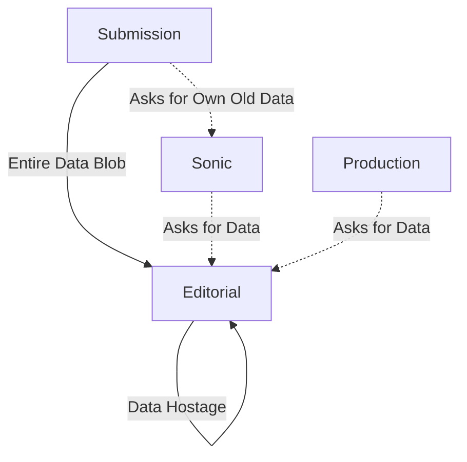

##### Breaking Free
# Fixing Our Architecture
	Moving Faster by Decoupling Data from Process

Our Editorial system has become an accidental data hoarder. This is the plan to untangle the knot and get back to building features quickly and safely.

---
### The Problem
	Every System Depends on Editorial

	We have a bottleneck. Our Editorial system owns data it doesn't need, and everyone else has to ask for it back.

This tight coupling makes every change slow and risky. A simple data update ripples across the entire ecosystem.

---
## The Research
	Event Storming Revealed the Truth

We ran event storming sessions with multiple SNAPP teams to map out how operations actually flow through our system. The results were eye-opening. MAYBE SHARE THEM???

---
### What We Discovered
	A Clear Bounded Context Violation

	**The Finding:** Draft submission operations form a natural unity - a "bounded context" in DDD terms. But our architecture breaks this boundary repeatedly.

The Submission system has to ask other systems for data it should own and control.

---
### The Smoking Gun
	Submission System Asking for Its Own Data

	**Example:** The Submission system asks Editorial for the title of a submission.

But think about this: *who else can change that title?* Only the Submission system itself. Yet it has to go through Editorial to get its own data back.

This is a fundamental boundary violation. The system that controls the lifecycle of data shouldn't need to ask another system for it.

---
## The Current Mess
	Editorial as Accidental Data Store

The Submission system even has to ask Editorial for its own historical data through Sonic. That's backwards.

---
### What's Wrong Here?
	We've Mixed Two Different Things

	**Submission Data:** The science itself - changes when authors revise
	**Review Data:** The review process - changes when editors take action

These change for different reasons, interest different people, but we've tied them together. This makes it impossible to evolve each independently.

---
### Domain-Driven Design Says...
	Respect the Bounded Context

	**Core Principle:** Each bounded context should own its data and lifecycle completely.

The event storming sessions showed us that draft submissions have their own clear operational boundaries. Our current architecture violates these natural boundaries by scattering ownership across systems.

When a system has to ask another system for data it should control, you've broken the bounded context. This creates the coupling that's slowing us down.

---
## What is a Bounded Context?
	Think of it Like Cooking Lasagne

Imagine you're making lasagne at home. You have your kitchen with all the ingredients, tools, and oven. You cook it, it's delicious, and it's ready to eat.

	**But here's what we're doing now:** We take our finished lasagne to our neighbour's house and ask them to store it for us.

Every time we want to eat our own lasagne, we have to go to the neighbour's house and bring it back home. Over and over again.

---
### The Current Mess: Lasagne at the Neighbour's
	We Cook It, They Store It, We Retrieve It

**What happens in our system:**
- Submission system "cooks" the author data (processes uploads, validates, organises)
- Hands the "finished lasagne" (complete submission) to Editorial to store
- Every time it needs its own data, it has to go to Editorial and ask for it back

This is as ass backwards as storing your own dinner at someone else's house.

---
### The Responsibility Problem
	Half-Cooked Lasagne for Guests

**Even worse:** Sometimes we invite neighbours (Editorial) over for dinner, but we give them a half-cooked lasagne and tell them to ENJOY!

	**Translation:** Submission system sends submissions with unscanned files to Editorial, expecting Editors to be able to do their work with it.

This violates the principle that whoever cooks the lasagne and _invites the neighbours around to eat it_, should _finish cooking the lasagne_. You don't serve half-raw food to guests.

Please, please stop thinking of all the counter example of how you deal with lasagne.

---
### What Should Happen
	Cook Completely, Store At Your Home, Share When Ready

--- 
### The right way
	- Cook your lasagne completely in your own kitchen
	- Store it in your own fridge
	- When neighbours want some, bring them a proper serving
	- Never ask neighbours to store your food or finish cooking it - _that's weird!_
---
### Translation
	- Submission system processes author data completely
	- Stores it in its own system  
	- When Editorial needs submission data, Submission system provides it
	- Never sends incomplete data or asks Editorial to store submission data - _that's weird!_

---
### The Submission System Should Be Like This Kitchen
	Self-Contained Lasagne Making

The event storming revealed that submission operations form a natural unity. Just like making lasagne from start to finish in one kitchen, the submission system should handle author data from start to finish.

	**Right now, our "lasagne" lives in someone else's fridge, and we have to keep asking for it back.**

This violates the natural boundary that the research showed us exists.

---
## Three Guiding Principles
	How to Fix Our Architecture

Based on the bounded context research, here are the principles that should guide all our development work:

---
### 1. Well-Encapsulated Unity
	Keep Your Lasagne in Your Own Kitchen

	**Principle:** The submission system should be a complete "kitchen" where lasagne is made from start to finish and stored properly.

Everything needed to make and keep submission data should be within this boundary. No storing your dinner at someone else's house.

---
### 2. Single Source of Responsibility
	Whoever Cooks the Lasagne, Finishes the Lasagne

	**Principle:** The submission system should be responsible for author-provided data. It should cook it completely and be the only one that changes it.

Don't send half-cooked lasagne to your neighbours and expect them to finish it. Complete the work in your own kitchen, then share the finished product.

---
### 3. Never Ask for Your Own Data
	Don't Store Your Dinner at the Neighbor's

	**Principle:** The submission system should never need to ask other systems for submission data it created. Other systems should ask it when they need submission information.

You shouldn't have to go to your neighbour's house to get your own lasagne back. Keep your food in your own fridge.

---
### These Principles Guide All Work
	Every Feature Decision Should Respect the Boundary

When we're building features, we should ask:
- Does this respect the submission system's bounded context?
- Are we making the submission system ask others for its own data?
- Are we putting submission data responsibility where it belongs?

Following these principles will gradually fix our architecture through normal feature work.

---