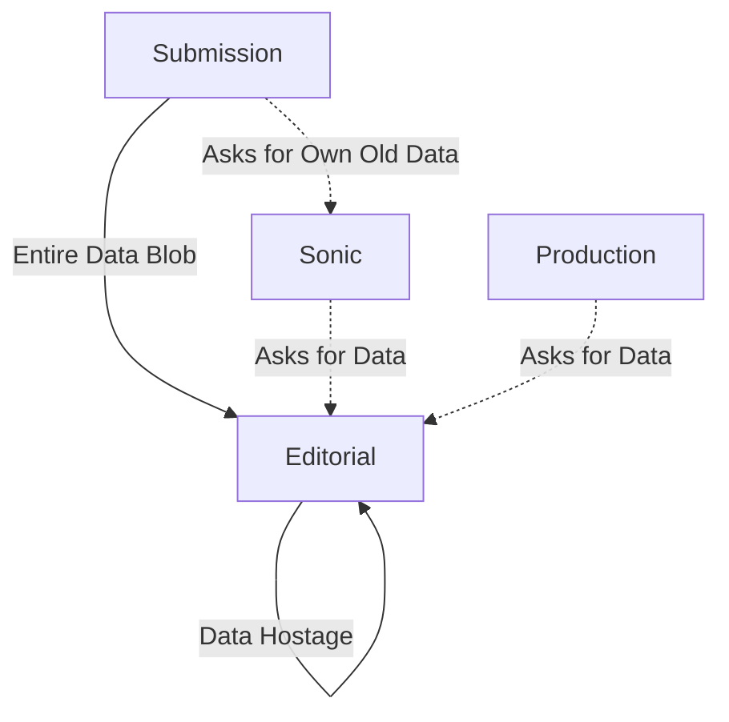
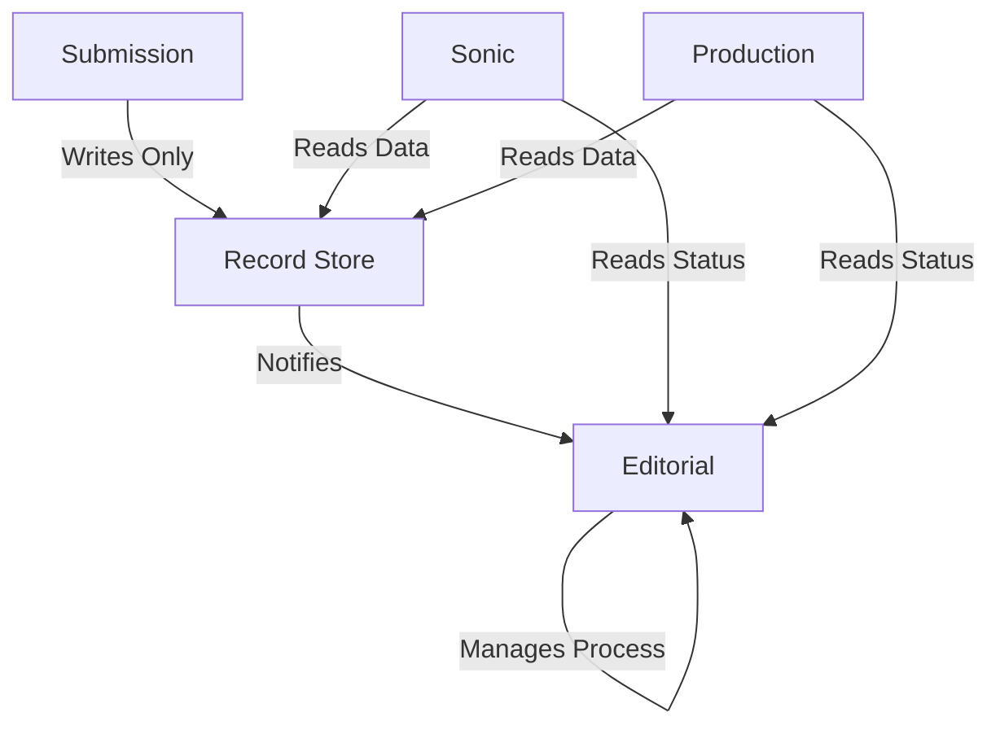

##### Breaking Free
# Fixing Our Architecture
	Moving Faster by Decoupling Data from Process

Our Editorial system has become an accidental data hoarder. This is the plan to untangle the knot and get back to building features quickly and safely.

---
### The Problem
	Every System Depends on Editorial

	We have a bottleneck. Our Editorial system owns data it doesn't need, and everyone else has to ask for it back.

This tight coupling makes every change slow and risky. A simple data update ripples across the entire ecosystem.

---
## The Research
	Event Storming Revealed the Truth

We ran event storming sessions with multiple SNAPP teams to map out how operations actually flow through our system. The results were eye-opening.

---
### What We Discovered
	A Clear Bounded Context Violation

	**The Finding:** Draft submission operations form a natural unity - a "bounded context" in DDD terms. But our architecture breaks this boundary repeatedly.

The Submission system has to ask other systems for data it should own and control.

---
### The Smoking Gun
	Submission System Asking for Its Own Data

	**Example:** The Submission system asks Editorial for the title of a draft submission.

But think about this: *who else can change that title?* Only the Submission system itself. Yet it has to go through Editorial to get its own data back.

This is a fundamental boundary violation. The system that controls the lifecycle of data shouldn't need permission to access it.

---
## The Current Mess
	Editorial as Accidental Data Store

The Submission system even has to ask Editorial for its own historical data through Sonic. That's backwards.

---
### What's Wrong Here?
	We've Mixed Two Different Things

	**Submission Data:** The science itself - changes when authors revise
	**Review Data:** The review process - changes when editors take action

These change for different reasons, interest different people, but we've tied them together. This makes it impossible to evolve each independently.

---
### Domain-Driven Design Says...
	Respect the Bounded Context

	**Core Principle:** Each bounded context should own its data and lifecycle completely.

The event storming sessions showed us that draft submissions have their own clear operational boundaries. Our current architecture violates these natural boundaries by scattering ownership across systems.

When a system has to ask another system for data it should control, you've broken the bounded context. This creates the coupling that's slowing us down.

---
### The Cost
	Simple Changes Become Complex

When you want to update submission data, you have to:
- Navigate the Editorial system
- Risk breaking the review process  
- Coordinate across multiple teams
- Test everything thoroughly

A one-line change becomes a multi-system deployment.

---
## The Solution
	Separate Data from Process

	**New Rule:** Submission data lives in its own dedicated store. Editorial focuses purely on managing the review workflow.

This simple change clarifies every system's role and eliminates the bottleneck.

---
### Respecting the Bounded Context
	What the Event Storming Taught Us

The research showed us that submission operations naturally cluster around the submission data. The Submission Record Store isn't just a technical solution - it's the architectural expression of the natural bounded context we discovered.

	**Key Insight:** When we align our architecture with the natural boundaries revealed by event storming, everything becomes simpler.

No more asking permission to access your own data.

---
### Meet the Submission Record Store
	Single Source of Truth for Author Data

Clean separation: data where it belongs, process where it belongs.

---
### Four Simple Rules
	Keep It Clean and Simple

1. **One Team Owns Both:** Submission system team owns the store
2. **Only One Writer:** Submission system is the only one that writes
3. **No Delete:** Records are permanent source of truth
4. **No Edit:** Only new versions can be submitted

These rules prevent confusion and keep the data integrity high.

---
## Migration Plan
	Four Phases to Safety

We don't have to do this all at once. Here's how we get there without breaking anything.

---
### Phase 1: Build the Foundation
	Create the New Store

- Build standalone Submission Record Store
- Lock it down - only Submission system can write
- Deploy and make it ready for action
- No data flows yet, just infrastructure

This phase has zero risk to existing systems.

---
### Phase 2: New Submissions Flow
	Start Using the New Path

- Update Submission system to write to new store
- Update Sonic and Production to check store first
- Fall back to old Editorial path if not found
- Only new submissions use the new flow

We run both systems in parallel. Safety first.

---
### Phase 3: Migrate Historical Data
	Move the Old Data Over

- Background script moves all historical data
- Heavy validation to ensure nothing is lost
- Systems still fall back to Editorial if needed
- Complete data migration with confidence

This is the heavy lifting phase, but it's safe because we have fallbacks.

---
### Phase 4: Cut Over Completely
	Remove the Old Dependencies

- Switch off the fallback mechanisms
- All systems now only ask the store for data
- Delete old code and data from Editorial
- Decoupling is complete

Editorial is now free to focus on what it does best: managing peer review.

---
### Alternative: Convert PRS Sender
	Should We Reuse What We Have?

	**Benefits:**
	- Already implements outbox pattern
	- Already receives whole submission records
	- Faster to market

	**Downsides:**
	- Carries unnecessary baggage
	- Coupled to Submission system
	- Missed opportunity for clean architecture

Sometimes starting fresh is worth the extra effort.

---
## Alternative: Evolutionary Approach
	No Big Bang Required

	**Different Strategy:** We don't have to do this all at once. As we build new features, we can gradually shift the boundary.

Each time we work on submission-related features, we move more author-generated data responsibility back where it belongs: the Submission system.

---
### Shifting Boundaries with Feature Work
	Move Responsibility Incrementally

**The Principle:** Every time we touch submission data, ask "Should this live in Editorial or Submission?"

**Examples:**
- New author metadata fields → Store in Submission system
- Draft title updates → Keep the logic in Submission system  
- Author contact changes → Submission system owns this lifecycle
- File upload improvements → Direct to Submission storage

Each feature becomes an opportunity to correct the boundary violation.

---
### Benefits of the Evolutionary Path
	Less Risk, Continuous Improvement

- **No Big Migration:** Avoid the complexity of moving all data at once
- **Feature-Driven:** Improvements happen as part of valuable work
- **Lower Risk:** Each change is smaller and easier to validate
- **Immediate Payoff:** Every shift reduces coupling incrementally
- **Learning Opportunity:** Discover edge cases gradually

We fix the architecture while delivering business value.

---
### The End State is the Same
	Just a Different Journey

Whether we migrate everything at once or shift boundaries with each feature, we end up in the same place: properly separated concerns and clearer ownership.

The evolutionary approach just spreads the work across multiple feature cycles, reducing risk and coordination overhead.

---
## The Payoff
	What We Get When We're Done

	**Faster Changes:** Update submission data without touching Editorial
	**Clearer Ownership:** Each system owns what it actually cares about
	**Independent Evolution:** Submission data and review process can evolve separately
	**Reduced Risk:** Changes are isolated to their relevant systems

We get back to building features instead of wrestling with architecture.

---
### The Real Win
	Focus on What Matters

Right now, we spend too much time working around our architecture instead of through it. This change gets us back to what we should be doing: building better features for our users.

---
## Next Steps
	Two Paths Forward

This isn't just a technical improvement - it's an investment in our ability to move fast and safely. The architecture should serve the product, not the other way around.

---
### Choose Your Strategy
	Big Migration or Evolutionary Shift

	**Path 1:** Full migration with the 4-phase plan - faster to complete, requires coordination
	**Path 2:** Evolutionary boundary shifting - lower risk, spreads across feature work

Both paths lead to the same destination: an architecture that respects natural boundaries and eliminates the Editorial bottleneck.

	**The Question:** Which approach fits our team's capacity and risk tolerance?