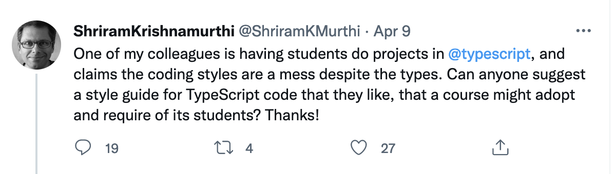
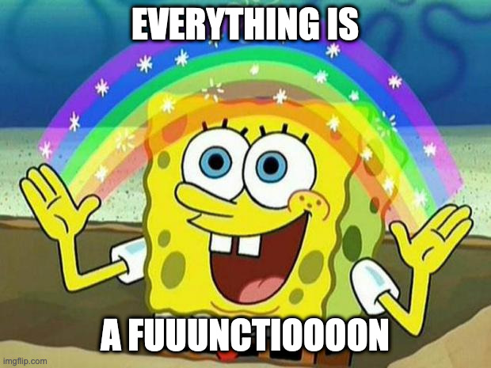
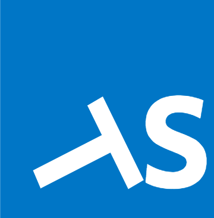

# So farewell then, TypeScript 

## _... we hardly knew ye_

---

# HI I'M DAVE

- Writing Server Side (Java|Type)Script for most of my career.
- No that's not a joke.
- Flow, my tears.

---


https://twitter.com/ShriramKMurthi/status/1512883907053727749

<!-- most of the replies were about prettier -->
---

# TypeScript is _not_ a language (imho)

<!-- hipsters and college professors think they've found a new popular strongly typed language. They haven't -->

---

# It is a (pretty good) type system for JavaScript

---

# If studying _SICP_ using Common Lisp is like "putting ketchup on caviar"...

---

# ... then TypeScript is like putting ketchup on JavaScript

---

# Take a look at the "Goals" and "Non-goals"

https://github.com/Microsoft/TypeScript/wiki/TypeScript-Design-Goals

<!-- For instance, TypeScript says that Arrays are covariant because it has to - some JavaScript code relies on this fact. -->

---

# TypeScript is welded to JavaScript

---

# So what's the recommended coding style for JavaScript?

---

# LOL ARE YOU FUCKING KIDDING ME?

---

# If anything, a TypeScript makes this worse

---

# Bare-Metal Arrogance + FP Smugness = Rust

-- Me

---

# JavaScript Chaos + FP Smugness = TypeScript

-- Also Me

---

# "But Dave," you say, "surely you have some opinions on how to use TypeScript?"

---

# No kidding

---


# 1. (Type|Java)Script is a poor tool for domain modelling with types, don't use it on the server.

## You can't even override equality operations FFS
## Good luck with DDD in most forms suckas

---

# 2. TypeScript is _THE BEST_ client-side language.

## TS ❤️ JS, this is a good thing!

## Context switching is _also a good thing_ when it's actually a _different context_.

---

# 3. Choose one of these two _incredible_ styles...

---

# a) Object Oriented Programming

---

## TypeScript looks like C#, so just write it like C#
## Beat up the language though
## e.g. [`Sett`](https://github.com/triptease/paid-search/blob/89be1a20cd2c803a41ed993f3a820ebe1284eecf/workspaces/shared/src/Sett.ts) by the Pelicans provides a conventional interface for equality in sets.

---

# b) "Functional Programming"

---

# NO, NOT THIS



amount of time I've spent in codebases of PURE FUNCTION SOUP


---

# OR THIS
  
https://gcanti.github.io/fp-ts/

---

# "Functional Cosplay" 
-- Nat Pryce

<!-- best quote to describe these libraries -->

---

# Try...

## `export` a type/interface from a module (file)
## create a `namespace` to shadow the type
## `export` related functions within the `namespace`

<!-- ## Imagine it's OCaml or SML -->

---

```ts
export interface Dog {
  name: string;
}

export namespace Dog {
  export function newDog(name: string): Dog {
    return { name };
  }

  export function sayName(dog: Dog): string {
    return dog.name;
  }
}
```

---

```ts
import { Dog } from './Bob';

const dog: Dog = Dog.newDog('bob');
```

---

# Thoughts for the future

### JS is influenced by Smalltalk / Self. What do they do?
### Object Oriented != Class Oriented; just use objects everywhere
### Opportunity for mixing dynamic patterns with static patterns

---

# Thank you

