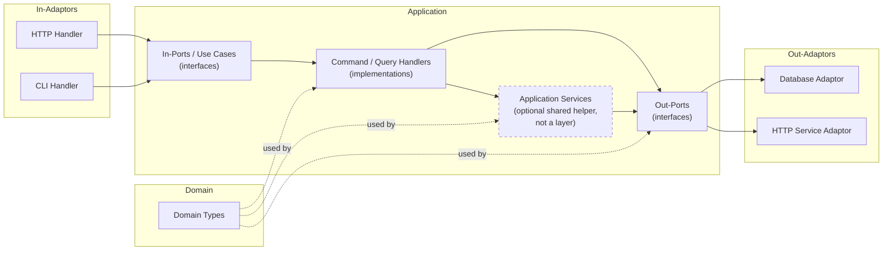
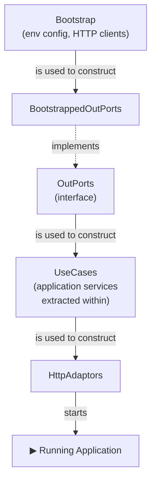
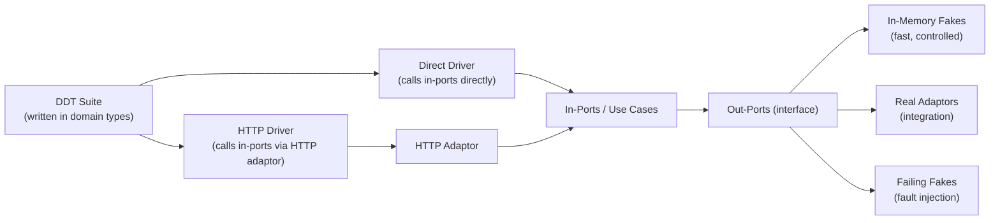
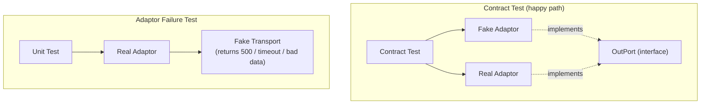

# The Architecture Is the Easy Part

This is an opinionated approach to building a system. It's aimed at web applications, but there's nothing here that wouldn't apply just as well to anything else that takes input from the world, does something, and gives something back.

It draws heavily on Ports and Adaptors (aka Hexagonal Architecture) and Clean Architecture, as laid out in [Getting Your Hands Dirty With Clean Architecture](https://learning.oreilly.com/api/v1/continue/9781805128373/). Where I think the book could be clearer, I depart from it. Familiarity with all of the above will help, but I'll define my terms as I go.

Here's what I want to cover:

- an overview of a Ports and Adaptors architecture, and the terminology that goes with it;
- how the code is organised in the abstract: which type depends on which;
- how the code is organised when you _start_ the thing up: the wiring;
- and a testing strategy that falls out of both.

But first, I'd like to try and explain why I'm doing this with a metaphor:

An architecture is a map of a city. It tells you where things are and how they connect - the domain in the middle, the ports at the edges, the roads between them. It's genuinely useful. But a map doesn't tell you how to _build_ the city. Hand someone a map and a pile of bricks and you'll get a mess.

What I actually want is the instructions. Not a blueprint but a Lego kit: _this_ bit first, then _this_ bit, then _this_ - a fixed order, one bag at a time, with the picture on the box to check yourself against.

The order is the point, because the order is what stops you making a mess. If there is exactly _one_ place where objects of type A get built, then you always know where to add the next one - and, just as importantly, you know you've done something wrong the moment you find yourself constructing an A somewhere else. An adaptor conjured up ad hoc inside an HTTP handler is the software equivalent of throwing up a warehouse in the middle of a residential street. If all the commercial buildings go up together, in the commercial-buildings step, the zoning violations get a lot harder to commit by accident.

The metaphor breaks down in one obvious place: we don't knock cities down and rebuild them from nothing every morning. But we do exactly that with software - every time the process starts, the whole city goes up again from an empty field. Software is weird like that. If anything it makes having the building instructions even more important.

OK, let's get going. Starting with our city map, the architecture.

## Architecture

### Names

The architecture should be apparent from the code. Not documented-in-a-wiki apparent, but _apparent from what you can see in front of you_. You should be able to open the source, look at the packages, the package names, the classes and interfaces, and see the shape of the whole thing and how the parts talk to each other. This is sometimes called [Screaming Architecture][screaming]: the code should shout what it is. It ought to be _hard_ to misunderstand.

(If you're in a city, you don't need a glossary to know you're in a residential street - you look, and it's a street with residences. And there might be street sign to really drive that home).

The easiest way to get there is to name the things after the role they play in the architecture. There is no prize for inventing your own vocabulary. If it's an out-port, call it an out-port. Same goes for the DDD terms. Consistency beats cleverness every time.


#### Domain

The domain has no dependencies. Nothing. It sits at the bottom and everything else is built on top of it.

There are two schools of thought about where the business logic lives.

**Anaemic domain** - the domain types are plain data structures, and all the behaviour lives in the application services and use cases (we'll meet them soon). The logic is easy to find, because it's always in the same place: the use case layer. The cost is that your domain objects can't protect their own invariants: nothing stops you putting one into an invalid state.

**Rich domain** - the behaviour lives inside the domain types themselves. The objects enforce their own invariants and are self-protecting. You get strong encapsulation, but the logic is harder to locate, and more of your design effort goes into the model.

For a simple domain, anaemic is usually fine; the use cases are the right home for the logic. As the domain gets more complicated, a richer model starts to earn its keep. This is a judgement call, not a rule, and anyone who tells you otherwise is selling something. And of course, there's a lot of space between the two where you can do something in-between.

Whether you keep commands separate from queries is a _different_ question, orthogonal to this one - you can do it with either kind of domain, and doing it inside a rich model is more or less what CQRS is.[^cqs]

If you care deeply about this bit (and you should), read the Domain-Driven Design book(s), but for the purposes of this document it's a detail.

#### Application

An application is the domain types _applied_ to solve a business problem.

If the whole application has an interface, that interface is all of the use cases together. If that interface has an implementation, that implementation is the collection of all of the command and query handlers (they're on their way, promise).

An application is made up of:

- the out-ports (interfaces);
- application services (holding some of them together);
- the use cases, aka the in-ports (interfaces);
- and the command and query handlers.

All of them depend on the domain, and all of them use its types. The application is the domain in motion.

#### Port

There are two kinds of port:

- an **Out**-Port is how the application talks to an external service. Also called a "driven" port, because it's where our system makes something else _do something_ - the external thing is driven by us.
- an **In**-Port is how other programs talk to our service. Also called a "driving" port, because it's where other things make our system _do something_ - they're in the driving seat.

Ports are _abstract_. They are interfaces. That's the whole point of them.

#### Use Case

I use "use case" and "in-port" interchangeably, but I prefer use case, because it keeps you honest: an in-port should be doing something _for a user_. That said, pick one and stick to it - consistency matters more than my preference.

#### Adaptor

An adaptor brings the outside world into the application, or carries the application out to the outside world. Adaptors are always paired with ports.

On the "in" side, an adaptor wraps an in-port to present an external interface. The application hands an in-port to an HTTP adaptor so it can be spoken to over HTTP; a command-line handler could wrap the same in-port to let you drive it from a terminal.

On the "out" side, an adaptor implements an out-port. A database connection gets wrapped up as an adaptor that implements the `Repository` out-port; a call to some other service gets wrapped as an adaptor implementing a `Service` out-port.

So: **in-adaptors** wrap in-ports to face the world, and **out-adaptors** wrap the world to present an out-port to the application.

#### Command / Query Handler

Every use case is either a command handler or a query handler. Both are implementations of use cases; the difference is what they do.

A query returns data and has no side effects. A command has side effects and returns nothing. Drawing that line at the level of the use case is [Command-Query Separation](https://martinfowler.com/bliki/CommandQuerySeparation.html) - CQS - applied to whole handlers rather than to individual methods.[^cqs]

As before: being consistent about this matters more than getting it theoretically perfect.

#### Application Service

Sometimes the same coordination logic - the same little dance of domain types and out-ports - turns up in use case after use case. When it does, you pull it out into an _application service_ and share it.

That is all an application service is: a bit of shared behaviour lifted out of the use cases that need it. It is emphatically _not_ a layer, and it is _not_ a boundary. In proper DDD a use case _is_ an application service - a command or query handler is just an application service that happens to be an in-port - and I'm only giving the shared bits a name of their own so we remember what they're for.

Two rules keep them honest, and they matter more than they look:

- an application service is **never an interface**, and must **never be faked or mocked**. It is real, always, in every test. The only thing you ever fake is an out-port - much more on this later.
- use cases **never depend on each other**. If two use cases need the same logic, that logic goes into an application service that sits _below_ them. It does not turn one use case into a dependency of another.

A use case, confusingly, _is_ an interface - the in-port that its handler implements. That's not a contradiction with the rule above: an interface and a _fake boundary_ are two different things, and I'll come back to why when we get to testing. An application service is neither an interface nor a boundary. It's just shared guts.

You don't always need one. A use case can - and often should - just call the out-ports directly.

---

Put all of that together and the architecture looks like this:




If you've seen the standard hexagonal architecture picture before, this is that, but I've just drawn left-to-right and with the names I'm going to use for the rest of the post, and I've used Mermaid because I'm lazy.

Right, so that's what we're aiming for in terms of a design. But how do we _build_ up that design from nothing?

## Wiring Up and Starting Your Application

When you start a program you create a pile of objects and then combine them in particular ways to get the effects you want, both the business logic and the way it talks to the outside world. This creating-and-combining is usually called _wiring up_, and that's what I'm going to call it too. 

Here's the thing the diagram above doesn't quite show. On paper the out-ports and the use cases sit at the same level of abstraction. In practice there's a dependency tree: the use cases depend on the out-ports (and on any application services we extract, which themselves depend on the out-ports). And that tree dictates the order you have to build things in.

This is ultimately the reason I've written all of this. I see a lot of lip-service paid to ports and adaptors, and some attempts to get there. But when it comes to the wiring up of big applications, people get confused about how to do it, then get lazy, and then the mess really begins. So here's some strong opinions.

### Ordering

The out-adaptors - the concrete implementations of the out-ports - are the _first_ things your application has to create. Everything else leans on them: the application services and use cases all depend on the out-ports, and ultimately your domain in action is just out-ports plus business logic. So the out-ports come first, and we work our way up from there. They are the rock upon which you will build your church, they are the place you will stand to move the world.

We are going to call each part of this "building-up" from the out-ports a _layer_, in honour and reference to layered architecture, and also because that's really what's happening: we're building our ports-and-adaptors application in layers. Because it's easy to think about it in that way, and harder to mess up, and harder to start leaking things between the layers if you can actually see the bloody layers.

What follows is a single idea applied over and over: an object is responsible for building the objects in a single layer, and it builds that layer by wiring together the objects of the layer below.

And to stop us from getting lost, we'll bundle together all the objects of each layer into a single fat object and pass that around (instead of having a method call with like xity billion arguments).

#### `Bootstrap`

At the very bottom you need something to provide the raw materials for the out-ports. Call it `Bootstrap`.

`Bootstrap` reads the configuration - the environment variables, the database connection strings, the URIs - and hands out the HTTP clients you'll need to build the out-adaptors. It's the one and only place that touches the messy outside-configuration world, so the rest of the wiring doesn't have to.

#### The `OutPorts` Interface

We want to build all the out-ports together, in one place, and then hand them to the layer above. So we give them a home: an `OutPorts` interface that exposes every out-port the application has.

It has to be an interface, because every out-port is an interface - that's dependency inversion at work, and it's why the domain never has to know what's actually implementing its out-ports. `OutPorts` needs _at least_ one real implementation, built up from the `Bootstrap` components - let's call it `BootstrappedOutPorts` - which constructs the out-ports the real life production application runs on. There may be others - there _will_ be others - but we'll get to them when we talk about testing.

#### The `UseCases` /  `Application` object

Same move again: we build `UseCases` from `OutPorts`. This object represents every use case the application has, and a use case, remember, is just an in-port. Its implementation is a `CommandHandler` or a `QueryHandler`.

You might have expected an `ApplicationServices` layer to appear here, in between. It doesn't. Application services aren't a layer - they're the shared bits of logic we lift out of the use cases, and they get constructed _in this same step_, from the out-ports, and handed to whichever use cases need them. They sit below the use cases, not between them and the out-ports. Wiring them as their own rung is exactly the mistake that leads someone to think they can be swapped, or faked, or mocked. They can't. The only thing we ever fake is an out-port.

`UseCases` is _not_ an interface. There should be exactly _one_ way for the application to be used - the domain types are always used the same way - so there's nothing to abstract over. (The individual use cases _are_ interfaces, mind you. That's dependency inversion again).

This layer could properly be called the `Application`, because it's where the domain model is finally applied to solve the business problem. If you gather all the use cases behind a single interface, I'd recommend calling it the `Application`.[^hub] 

#### The `Adaptors` (`HttpAdaptors`) object

And once more, from the top: we build `HttpAdaptors` from `UseCases`. In an HTTP application these are the adaptors that turn a request into a response - the router, the handlers, the controllers. They're the in-adaptors of the use cases.

Like the layers below, this object is concrete, and it's tied to _how_ the application faces the world: HTTP here, but it could just as well be a command line, a desktop UI, or something embedded. The rule of thumb is one use case to one route.

Bundling this all up, in HTTP with routing, the final interface we have is very simple:

```
Request -> Response
```

Once we've got this, we can set it running in a context - for HTTP, that's the internet, so we start listening for those requests on a port - and the application is alive.

### Overview

So the whole startup, from nothing to running, is:

1. Build `Bootstrap` from nothing.
2. Build `OutPorts` from `Bootstrap` (as out-adaptors).
3. Build `UseCases` - the Application - from `OutPorts` (extracting any shared logic into application services as you go).
4. Build `HttpAdaptors` (or whatever other in-adaptors) from `UseCases`.
5. Start the app.



This same ordering happens in test _and_ in production - but, crucially, a test may start and stop at different points along the chain. Hold onto that thought, because it's the whole trick behind the testing strategy.

To reiterate: I call each of these steps a _layer_, in the layered-architecture sense. And underneath all of them sits the domain: its types are used at every single layer.

#### Where does this code live?

Each of those "build the next layer from this one" steps is a function or a constructor, and it's worth being clear about where those functions belong - because it isn't where you might first reach for.

They are not part of the application, and they are certainly not part of the domain. A function that takes `OutPorts` and hands you back `UseCases` is _wiring_ - it's infrastructure, the same species of code as the thing that reads your config, the thing that builds `Bootstrap`, and the thing that opens a socket and starts the server listening. So that's where it lives: in the same packages, the same folders, as the rest of your infrastructure. Right at the edge, next to `main`.

This matters because it keeps the temptation out of the domain. The domain and the application never construct their own dependencies; they're _given_ them. The knowledge of how everything is assembled lives in exactly one place, out at the edge, and the inner layers stay blissfully ignorant of it. If you ever find a wiring function reaching into the domain package, something has gone wrong.

---

So we now have the "city map" of the architecture, and also the "blueprints" for how we build the city from nothing every time we construct our software. Now for the fun bit: testing.

## Testing

Testing here is done in terms of ports and adaptors, and it comes down to two questions:

- what do I want my out-ports to be?
- and at which layer am I going to test?

Get those two right and the failure scenarios mostly answer themselves.

### What do I want my out-ports to be?

In production, your out-ports come from `Bootstrap` - the real database, the real services.

In a test you usually don't want to stand all that up. So instead you provide a _different_ implementation of the `OutPorts` interface: one that hands out in-memory fakes for each out-port. As far as the rest of the application is concerned, nothing has changed - it's the same interface, wired up the same way - but now it's fast and easy to control.

The catch, and it's the important bit: the real and fake implementations must be _indistinguishable_ in behaviour. You don't get to hope this is true. You guarantee it with a contract test that runs against both.

Once you trust the fakes, you can drop them into the ordinary production wiring and build the domain on top of them exactly as you would for real - each layer wired the same way, just standing on a faster, more controllable set of out-ports. That's the feature we lean on to build Domain-Driven Tests.

This is the moment to clear up the confusion I promised to come back to. There are interfaces at _both_ edges of the application - the in-ports and the out-ports - and both are there for dependency inversion. But an interface is not the same thing as a _fake boundary_, and only one of the two edges is one:

| Thing | An interface? | What a test does with it |
|---|---|---|
| In-port / use case | yes | **drives from** it - runs the real implementation underneath |
| Out-port | yes | **substitutes** it - the _only_ place we ever swap in a fake |
| Application service | no | nothing - it's internal, and always real |

The in-port is an interface so that something outside - an adaptor, or a test - can _call_ the application without knowing what's behind it. You drive the real thing through it; you never replace it with a fake. The out-port is an interface so that the application can call _out_ without knowing what's behind it - and that's exactly the seam where a test swaps the real thing for a fake. Same language, two completely different jobs. Keep them straight and "the only thing you ever fake is an out-port" stops sounding like a contradiction and starts sounding like the whole point.

### Domain-Driven Tests (DDTs)

A DDT is a test suite written against the in-ports of the application - the use cases - using domain types.[^ddt-refs] It's a poor name, I'll admit. What it really is is a sort of mega-contract wrapped around the whole application: a suite that pins down the _invariants of the application's behaviour_, independent of how you drive it and independent of what's behind the out-ports.

The name is about where the tests are written _from_ - the domain boundary - not about any particular testing religion.



#### Two axes of variation

If the wiring has been done well, you can test the application across two independent axes.

The first is **how you drive the in-ports**: call them directly, with no transport in the way, or call them through an in-adaptor such as HTTP.

The second is **what backs the out-ports**: in-memory fakes (fast, controlled), the real implementations (integration), or deliberately failing fakes (fault injection).

And these combine freely:

| Driver | Out-ports | What you're testing |
|---|---|---|
| Direct | In-memory fakes | Application logic, fast |
| HTTP adaptor | In-memory fakes | HTTP wiring + logic |
| Direct | Real out-ports | Logic + persistence integration |
| HTTP adaptor | Real out-ports | Full stack |
| Direct | Failing fakes | Failure handling |

The same test suite runs across every one of these configurations. The tests don't change - _only what they're wired to_.

#### How DDTs are written

The tests are written in domain types, against the in-port interfaces. In the "unwrapped" configuration they call the use case implementations directly. In the "wrapped" configuration the very same interactions are pushed through a transport adaptor - HTTP, say - which turns them into requests and back again.[^driver-refs]

The consequence is worth dwelling on: your HTTP adaptor tests are _not_ a separate suite fussing over JSON shapes and status codes. They're the _same_ behavioural assertions, run through HTTP. If the adaptor is wired up correctly, the suite passes. If it isn't, it fails in domain terms - not HTTP terms.

The confidence that buys you stacks up nicely. The in-memory out-ports are trusted, because of the contract tests. The wiring is trusted, because the DDT suite passes in the direct configuration. The adaptors are trusted, because the same DDT suite passes in the wrapped configuration. Every layer's correctness is checked by one suite, not by a scattering of disconnected tests that each know a little and trust a lot.

### Fault injection

The contract test only promises the happy path. How the application copes with failures _above_ the adaptor is already covered - that's DDTs with failing fake out-ports, from the table above.

That leaves one gap. You can't reliably provoke a failure _inside_ a real adaptor. You can't make your database throw a connection error on demand - not without some form of remote fault injection, and that's another post.

So to test the adaptor's own error handling, you go underneath it: inject a fake transport - a fake HTTP client, a fake DB driver - into the _real_ adaptor. Now you can make the transport return a 500, a timeout, or a lump of malformed nonsense, and assert on what the adaptor does with it. All in isolation, without needing the real external system to have a bad day on cue.



## A worked example: where does authentication go?

To keep this from turning into a book, I've pulled the worked example out into its own post: [Where Does Authentication Go?](/posts/2024/11/28/where-does-authentication-go). It takes everything above - use cases, out-ports, DDTs, the single fake seam - and points it at the one problem nearly everyone puts in the wrong place. If the approach here convinced you, that's where you see it earn its keep.

## So what was all that for?

The architecture, in the end, is the easy part. The hexagon has been drawn a thousand times, and you can find the definitions of ports and adaptors anywhere. I'm almost sick to death of seeing it. It's the easy part. Drawing a map is easy.

The harder bit is the _order and the wiring_ - building the city the same way every time, one layer from the last, with exactly one place where each kind of thing gets made. Do that, and you make the architecture _scream_. Do that, and you make the two edges of your application _scream_ too. And if you can do that then you can get some very interesting and useful advantages.

First, you know exactly where to put the things you're adding. A new database? Bootstrap an out-port in the box above. A new use case? Goes in the use cases. And you'll see how to wire it all up too, without one big messy file full of cross-cutting wiring that's just waiting for you to make a mistake and mess up your architecture.

Next, because you've done this, you now have a perfect view on your out-ports. They are now the single seam in the application - they are the only place anything gets faked. Everything above them is real, always real, wired the same in a test as it is in production.

Finally, you have a perfect view on your in-ports. They are the single _language_ that your application speaks to the outside world. Because a use case is written to express what the application does - in domain terms, readably, for a user - that's the language you write your tests in. And because every in-adaptor has an inverse - a _driver_ that turns the same domain-level calls into HTTP, or a CLI invocation, or whatever the adaptor speaks - you can point that one suite of tests straight at the use cases, or _through_ the HTTP adaptor into the running server, and it reads identically either way. Every test, at every level, speaks the application's own language. None of them speak JSON.

That symmetry is what the whole testing strategy hangs off. One place to fake, one language to drive, and the same suite means something whether it's running against in-memory fakes in a millisecond or against the real database over real HTTP. It's why "the only thing you ever fake is an out-port" is worth repeating until it's boring. Get the wiring right and the tests almost write themselves; get it wrong - smear the construction across the codebase, let a use case lean on another use case, mock something in the middle - and no amount of clever testing will buy the confidence back.

[screaming]: https://blog.cleancoder.com/uncle-bob/2011/09/30/Screaming-Architecture.html

[^cqs]: Two acronyms, easily confused. **CQS** (Command-Query Separation, Bertrand Meyer) is the rule that a thing either _changes_ state and returns nothing, or _reports_ state and changes nothing - never both. **CQRS** (Command-Query Responsibility Segregation, Greg Young) takes that same split and pushes it much further down, into the model itself: a separate write model for the commands and a read model for the queries, sometimes with separate data stores behind them. What I'm describing here is the modest version - CQS drawn at the use-case boundary, so each handler is purely one or purely the other. If you wanted to, you could push that separation all the way down into the domain and end up with something much closer to full CQRS. It's the same idea, just taken further - and a much bigger commitment than this document needs.

[^ddt-refs]: I didn't invent any of this - I've just given it a name I can remember. If you want it from people who've thought about it harder than I have: Aslak Hellesøy [walks through the idea here](https://www.youtube.com/watch?v=sUclXYMDI94), and Nat Pryce [does the same here](https://www.youtube.com/watch?v=Fk4rCn4YLLU). Both are, sadly, YouTube videos.

[^driver-refs]: The trick underneath this - separating the _test driver_ from the _implementation_ of the test, with a little DSL in the middle so the same tests can run against different bindings - is covered beautifully by Chris James and Riya Dattani [in this talk](https://www.youtube.com/watch?v=ZMWJCk_0WrY), and again, in Go and in writing, by Chris James in [Learn Go with Tests](https://quii.gitbook.io/learn-go-with-tests/testing-fundamentals/working-without-mocks).

[^hub]: I've seen it called a `Hub` before in some situations - you can picture it as the bit in the middle of the hexagon where the individual use cases form the spokes of a wheel - but I think this muddies things too much with a new word.