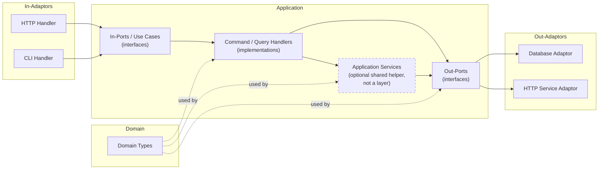
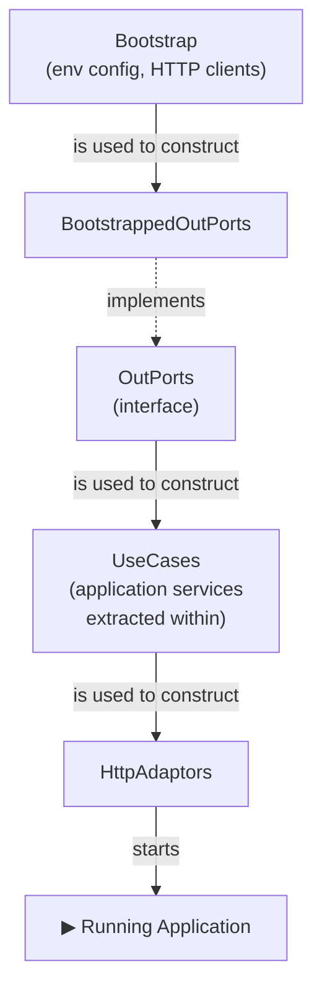

# The Architecture Is the Easy Part

This is an opinionated approach to building a system. It's aimed at web applications, but there's nothing here that wouldn't apply just as well to anything else that takes input from the world, does something, and gives something back.

It draws heavily on Ports and Adaptors - [Alistair Cockburn's Hexagonal Architecture](https://alistair.cockburn.us/hexagonal-architecture/), which is where the pattern, and most of the terminology I use here, comes from - and on Clean Architecture, as laid out in [Getting Your Hands Dirty With Clean Architecture](https://learning.oreilly.com/api/v1/continue/9781805128373/). Where I think the book or Cockdurn could be clearer, I depart from them. Familiarity with all of the above will help, but I'll define my terms as I go.

Here's what I want to cover:

- an overview of a Ports and Adaptors architecture, and the terminology that goes with it;
- how the code is organised in the abstract: which type depends on which;
- how the code is organised when you _start_ the thing up: the wiring;

But first, I'd like to try and explain why I'm doing this with a metaphor:

An architecture is a map of a city. It tells you where things are and how they connect - the domain in the middle, the ports at the edges, the roads between them. It's genuinely useful. But a map doesn't tell you how to _build_ the city. Hand someone a map and a pile of bricks and you'll get a mess.

What I actually want is the instructions. Not a blueprint but a Lego kit: _this_ bit first, then _this_ bit, then _this_ - a fixed order, one bag at a time, with the picture on the box to check yourself against.

The order is the point, because the order is what stops you making a mess. If there is exactly _one_ place where objects of type A get built, then you always know where to add the next one - and, just as importantly, you know you've done something wrong the moment you find yourself constructing an A somewhere else. An adaptor conjured up ad hoc inside an HTTP handler is the software equivalent of throwing up a warehouse in the middle of a residential street. If all the commercial buildings go up together, in the commercial-buildings step, the zoning violations get a lot harder to commit by accident.

The metaphor breaks down in one obvious place: we don't knock cities down and rebuild them from nothing every morning. But we do exactly that with software - every time the process starts, the whole city goes up again from an empty field. Software is weird like that. If anything it makes having the building instructions even more important.

OK, let's get going. Starting with our city map, the architecture.

## Architecture

### Why even have an architecture?

This might sound mad, but it's worth at least asking ourselves why we want to choose an architecture. What even is architecture in software, and why do we care about it? I think particularly about when I want to talk to THE BUSINESS. Why do they care?

First, I hate the word architecture. The first thing I think about is architects, who in parodic form (mostly) go about drawing lines and boxes in their ivory towers, never build anything, aren't on the hook for delivering anything, floating around with a smug sense of superiority because they never have to get their hands dirty with the irrelevancies of working software.

I usually prefer the word "design" as it tends to scare people off less. Design is what we do all the time - write a class, a method signature, some functions that all work together. We're always designing. Architecture feels so... distant and grown-up.

Well, let me tell you: architecture is just design, even the really big architectures. It's just design. The only difference is usually scale. We design classes, but we feel like we're architecting distributed systems.

The next thing I want to tell you is that if you can design the interactions between a few stateful objects in object-oriented programming, then congratulations, you have the skills to be an architect. The same problems that come up at the "object" level (usually to do with time and state - it's always time and state and concurrency) exist all the way up the stack. It's one of the benefits of the "object metaphor": an object can be seen as a tiny little computer. So if you can work with lots of tiny little computers, you can also work with lots of big wobbly computers.

The reason we're talking about a ports and adaptors architecture here is because "ports and adaptors design" sounds a bit silly. So architecture it is, but feel free to say "design" in your head.

But we've not answered my question: why architect at all? Two tempting answers, both too thin.

#### It tells you where things are?

In its simplest form, architecture is just a folder structure. We put _this_ sort of function over _here_ and _that_ sort of function over _there_. So now I know where all the functions that deal with maths are.

Well, that's nice. But what sort of functions are we talking about?

#### It makes things work?

The architecture should let the system do the things that it's meant to do. So if it's a web app, then some of those functions we're talking about above are going to have to be what sometimes gets called a "handler" - HTTP request in, HTTP response out.

Or not! You could just have one huge function, right? Does all the routing, does all the handling, does all the logic. A big old `while` loop. So why bother architecting again?

#### It makes things _easy to change_

This is the real answer, and it's worth the whole post. What do I actually need in order to make a change to a system without pain?

- I need to know how the system works right now;
- I need to decide where the change needs to be made;
- and how to make that change;
- then I need to do it...
- ...see that it works...
- ...and do all that without making it harder to make any _other_ change in the future.

A good architecture hands you each one. Let's take them in turn.

##### Know how it works right now

The architecture should tell you how the system works now. It should tell a story. It's hard to see that story if there are three different ways of parsing a request and seven ways of serializing JSON - and it's even worse when sometimes you serialize the JSON in a request handler and other times you do it before.

We make the story easier to read by giving it a narrative flow - first _this_, then _this_ - and naming each of the stages. We make it easier to see that two stories are the _same_ by giving the same names to the parts that do the same job. Decomposed and named consistently, the code becomes something you can read.

So when we come to make a change, we can see how the existing small parts are used to tell a story - and how we'd use them to tell a new one.

##### Know where the change goes

<!-- STUB: one obvious home per kind of change - new adaptor / new out-port / new use case - and one obvious place it does *not* belong. This is the beat the conclusion pays off. -->

##### Know how to make it

<!-- STUB: parts are small, uniform, and fall into distinct categories, so you write the new one in imitation of its siblings. You already know the shape. -->

##### Actually make it - locally

<!-- STUB: the change is bounded; it lands in one place and doesn't ripple. No surgery smeared across the codebase. -->

##### See that it works

<!-- STUB: to test a thing you take it apart and hold a piece still - exactly what this architecture lets you do (drive the in-port, fake the out-port). A whole strategy of its own: [the testing post](/posts/2026/7/3/how-do-you-test-a-ports-and-adaptors-application). -->

##### ...and don't make the next change harder

Here's the kicker: when you break your system into small parts, you need to have an eye on the future. It's not enough that it be "easy to change". It should be easy to change _in the way you expect it to change_.

If I've built a web app for internet banking, I'd expect it to be easy to add a new route, add a new sort of account, and change the colour of the home page. I'd expect it to be harder to add a new YouTube video to every account. Harder - but not impossible.

And here's the final kicker: not only do you want it easy to change in the ways you expect, you want to _keep_ it that easy to change after you've changed it. This is where we could go and have a whole discussion about technical debt - which is really just the stuff you added that stops you making the changes you need to make easily, usually because you didn't know what changes were coming.

That trick - seeing into the future to work out what changes are coming down the line - is why good developers spend so long thinking about the _domain_: the situation the application lives in, the problem it's there to solve. Understand the domain and you understand the changes that are realistically coming, so that you know - to pick the classic - that using a floating-point number for an account balance is _a bad idea_.

And to be clear, I don't mean the "business" domain in some grand sense. What ports and adaptors gives you is a design that separates the logic for working with your domain from the concerns of talking to, and changing things in, the rest of the world. It makes change easy by telling a _simple_ story: small objects that translate the outside world into your domain, solve the problem, and translate back out again. Because the story is simple, you can write a new part in imitation of the others; because the objects are small with simple jobs, you know how to write each one; and because they fall into distinct categories, you know where each one goes.

---

Given all of the above, let's go through what I think you should be doing for ports-and-adaptors.

### Names

The architecture should be apparent from the code. Not documented-in-a-wiki apparent, but _apparent from what you can see in front of you_. You should be able to open the source, look at the packages, the package names, the classes and interfaces, and see the shape of the whole thing and how the parts talk to each other. This is sometimes called [Screaming Architecture][screaming]: the code should shout what it is. It ought to be _hard_ to misunderstand.

(If you're in a city, you don't need a glossary to know you're in a residential street - you look, and it's a street with residences. And there might be street sign to really drive that home).

The easiest way to get there is to name the things after the role they play in the architecture. There is no prize for inventing your own vocabulary. If it's an out-port, call it an out-port. Same goes for the DDD terms. Consistency beats cleverness every time.


#### Domain

The domain has no dependencies. Nothing. It sits at the bottom and everything else is built on top of it.

There are two schools of thought about where the business logic lives.

**Anaemic domain** - the domain types are plain data structures, and all the behaviour lives in the application services and use cases (we'll meet them soon). The logic is easy to find, because it's always in the same place: the use case layer. The cost is that your domain objects can't protect their own invariants: nothing stops you putting one into an invalid state.

**Rich domain** - the behaviour lives inside the domain types themselves. The objects enforce their own invariants and are self-protecting. You get strong encapsulation, but the logic is harder to locate, and more of your design effort goes into the model.

For a simple domain, anaemic is usually fine; the use cases are the right home for the logic. As the domain gets more complicated, a richer model starts to earn its keep. This is a judgement call, not a rule, and anyone who tells you otherwise is selling something. And of course, there's a lot of space between the two where you can do something in-between.

Whether you keep commands separate from queries is a _different_ question, orthogonal to this one - you can do it with either kind of domain, and doing it inside a rich model is more or less what CQRS is.[^cqs]

If you care deeply about this bit (and you should), read the Domain-Driven Design book(s), but for the purposes of this document it's a detail.

#### Application

An application is the domain types _applied_ to solve a business problem.

If the whole application has an interface, that interface is all of the use cases together. If that interface has an implementation, that implementation is the collection of all of the command and query handlers (they're on their way, promise).

An application is made up of:

- the out-ports (interfaces);
- application services (holding some of them together);
- the use cases, aka the in-ports (interfaces);
- and the command and query handlers.

All of them depend on the domain, and all of them use its types. The application is the domain in motion.

#### Port

There are two kinds of port:

- an **Out**-Port is how the application talks to an external service. Also called a "driven" port, because it's where our system makes something else _do something_ - the external thing is driven by us.
- an **In**-Port is how other programs talk to our service. Also called a "driving" port, because it's where other things make our system _do something_ - they're in the driving seat.

Ports are _abstract_. They are interfaces. That's the whole point of them.

#### Use Case

I use "use case" and "in-port" interchangeably, but I prefer use case, because it keeps you honest: an in-port should be doing something _for a user_. That said, pick one and stick to it - consistency matters more than my preference.

#### Adaptor

An adaptor brings the outside world into the application, or carries the application out to the outside world. Adaptors are always paired with ports.

On the "in" side, an adaptor wraps an in-port to present an external interface. The application hands an in-port to an HTTP adaptor so it can be spoken to over HTTP; a command-line handler could wrap the same in-port to let you drive it from a terminal.

On the "out" side, an adaptor implements an out-port. A database connection gets wrapped up as an adaptor that implements the `Repository` out-port; a call to some other service gets wrapped as an adaptor implementing a `Service` out-port.

So: **in-adaptors** wrap in-ports to face the world, and **out-adaptors** wrap the world to present an out-port to the application.

#### Command / Query Handler

Every use case is either a command handler or a query handler. Both are implementations of use cases; the difference is what they do.

A query returns data and has no side effects. A command has side effects and returns nothing. Drawing that line at the level of the use case is [Command-Query Separation](https://martinfowler.com/bliki/CommandQuerySeparation.html) - CQS - applied to whole handlers rather than to individual methods.[^cqs]

As before: being consistent about this matters more than getting it theoretically perfect.

#### Application Service

Sometimes the same coordination logic - the same little dance of domain types and out-ports - turns up in use case after use case. When it does, you pull it out into an _application service_ and share it.

That is all an application service is: a bit of shared behaviour lifted out of the use cases that need it. It is emphatically _not_ a layer, and it is _not_ a boundary. In proper DDD a use case _is_ an application service - a command or query handler is just an application service that happens to be an in-port - and I'm only giving the shared bits a name of their own so we remember what they're for.

Two rules keep them honest, and they matter more than they look:

- an application service is **never an interface**, and must **never be faked or mocked**. It is real, always, in every test. The only thing you ever fake is an out-port.
- use cases **never depend on each other**. If two use cases need the same logic, that logic goes into an application service that sits _below_ them. It does not turn one use case into a dependency of another.

A use case, confusingly, _is_ an interface - the in-port that its handler implements. That's not a contradiction with the rule above: an interface and a _fake boundary_ are two different things. The in-port is an interface you _drive from_ - you run the real thing behind it, you never fake it - while the out-port is the interface you _substitute_ a fake for. An application service is neither an interface nor a boundary. It's just shared guts.

You don't always need one. A use case can - and often should - just call the out-ports directly.

---

Put all of that together and the architecture looks like this:




If you've seen the standard hexagonal architecture picture before, this is that, but I've just drawn left-to-right and with the names I'm going to use for the rest of the post, and I've used Mermaid because I'm lazy.

Right, so that's what we're aiming for in terms of a design. But how do we _build_ up that design from nothing?

## Wiring Up and Starting Your Application

When you start a program you create a pile of objects and then combine them in particular ways to get the effects you want, both the business logic and the way it talks to the outside world. This creating-and-combining is usually called _wiring up_, and that's what I'm going to call it too. 

Here's the thing the diagram above doesn't quite show. On paper the out-ports and the use cases sit at the same level of abstraction. In practice there's a dependency tree: the use cases depend on the out-ports (and on any application services we extract, which themselves depend on the out-ports). And that tree dictates the order you have to build things in.

This is ultimately the reason I've written all of this. I see a lot of lip-service paid to ports and adaptors, and some attempts to get there. But when it comes to the wiring up of big applications, people get confused about how to do it, then get lazy, and then the mess really begins. So here's some strong opinions.

### Ordering

The out-adaptors - the concrete implementations of the out-ports - are the _first_ things your application has to create. Everything else leans on them: the application services and use cases all depend on the out-ports, and ultimately your domain in action is just out-ports plus business logic. So the out-ports come first, and we work our way up from there. They are the rock upon which you will build your church, they are the place you will stand to move the world.

We are going to call each part of this "building-up" from the out-ports a _layer_, in honour and reference to layered architecture, and also because that's really what's happening: we're building our ports-and-adaptors application in layers. Because it's easy to think about it in that way, and harder to mess up, and harder to start leaking things between the layers if you can actually see the bloody layers.

What follows is a single idea applied over and over: an object is responsible for building the objects in a single layer, and it builds that layer by wiring together the objects of the layer below.

And to stop us from getting lost, we'll bundle together all the objects of each layer into a single fat object and pass that around (instead of having a method call with like xity billion arguments).

#### `Bootstrap`

At the very bottom you need something to provide the raw materials for the out-ports. Call it `Bootstrap`.

`Bootstrap` reads the configuration - the environment variables, the database connection strings, the URIs - and hands out the HTTP clients you'll need to build the out-adaptors. It's the one and only place that touches the messy outside-configuration world, so the rest of the wiring doesn't have to.

#### The `OutPorts` Interface

We want to build all the out-ports together, in one place, and then hand them to the layer above. So we give them a home: an `OutPorts` interface that exposes every out-port the application has.

It has to be an interface, because every out-port is an interface - that's dependency inversion at work, and it's why the domain never has to know what's actually implementing its out-ports. `OutPorts` needs _at least_ one real implementation, built up from the `Bootstrap` components - let's call it `BootstrappedOutPorts` - which constructs the out-ports the real life production application runs on. There may be others - there _will_ be others - but we'll get to them when we talk about testing.

#### The `UseCases` /  `Application` object

Same move again: we build `UseCases` from `OutPorts`. This object represents every use case the application has, and a use case, remember, is just an in-port. Its implementation is a `CommandHandler` or a `QueryHandler`.

You might have expected an `ApplicationServices` layer to appear here, in between. It doesn't. Application services aren't a layer - they're the shared bits of logic we lift out of the use cases, and they get constructed _in this same step_, from the out-ports, and handed to whichever use cases need them. They sit below the use cases, not between them and the out-ports. Wiring them as their own rung is exactly the mistake that leads someone to think they can be swapped, or faked, or mocked. They can't. The only thing we ever fake is an out-port.

`UseCases` is _not_ an interface. There should be exactly _one_ way for the application to be used - the domain types are always used the same way - so there's nothing to abstract over. (The individual use cases _are_ interfaces, mind you. That's dependency inversion again).

This layer could properly be called the `Application`, because it's where the domain model is finally applied to solve the business problem. If you gather all the use cases behind a single interface, I'd recommend calling it the `Application`.[^hub] 

#### The `Adaptors` (`HttpAdaptors`) object

And once more, from the top: we build `HttpAdaptors` from `UseCases`. In an HTTP application these are the adaptors that turn a request into a response - the router, the handlers, the controllers. They're the in-adaptors of the use cases.

Like the layers below, this object is concrete, and it's tied to _how_ the application faces the world: HTTP here, but it could just as well be a command line, a desktop UI, or something embedded. The rule of thumb is one use case to one route.

Bundling this all up, in HTTP with routing, the final interface we have is very simple:

```
Request -> Response
```

Once we've got this, we can set it running in a context - for HTTP, that's the internet, so we start listening for those requests on a port - and the application is alive.

### Overview

So the whole startup, from nothing to running, is:

1. Build `Bootstrap` from nothing.
2. Build `OutPorts` from `Bootstrap` (as out-adaptors).
3. Build `UseCases` - the Application - from `OutPorts` (extracting any shared logic into application services as you go).
4. Build `HttpAdaptors` (or whatever other in-adaptors) from `UseCases`.
5. Start the app.



This same ordering happens whether you're starting the real thing or standing up a slice of it - and a slice can start and stop at different points along the chain. That flexibility is where a lot of the value hides - enough that it gets [its own post](/posts/2026/7/3/how-do-you-test-a-ports-and-adaptors-application).

To reiterate: I call each of these steps a _layer_, in the layered-architecture sense. And underneath all of them sits the domain: its types are used at every single layer.

#### Where does this code live?

Each of those "build the next layer from this one" steps is a function or a constructor, and it's worth being clear about where those functions belong - because it isn't where you might first reach for.

They are not part of the application, and they are certainly not part of the domain. A function that takes `OutPorts` and hands you back `UseCases` is _wiring_ - it's infrastructure, the same species of code as the thing that reads your config, the thing that builds `Bootstrap`, and the thing that opens a socket and starts the server listening. So that's where it lives: in the same packages, the same folders, as the rest of your infrastructure. Right at the edge, next to `main`.

This matters because it keeps the temptation out of the domain. The domain and the application never construct their own dependencies; they're _given_ them. The knowledge of how everything is assembled lives in exactly one place, out at the edge, and the inner layers stay blissfully ignorant of it. If you ever find a wiring function reaching into the domain package, something has gone wrong.

## So what was all that for?

The architecture, in the end, is the easy part. The hexagon has been drawn a thousand times, and you can find the definitions of ports and adaptors anywhere. I'm almost sick to death of seeing it. It's the easy part. Drawing a map is easy.

The harder bit is the _order and the wiring_ - building the city the same way every time, one layer from the last, with exactly one place where each kind of thing gets made. Do that, and you make the architecture _scream_. Do that, and you make the two edges of your application _scream_ too. And if you can do that then you can get some very interesting and useful advantages.

First, you always know where to make a change. A new database? An out-adaptor, behind the out-port that's already there. A new way in - a CLI, a queue consumer? An in-adaptor on the in-ports you already have. A new thing the application does? A use case. There's one obvious home for each kind of change - and, just as important, one obvious place it does _not_ belong. You're never hunting, and you're never smearing logic across one big cross-cutting file that's just waiting for you to get it wrong.

That's the whole point of the two edges. They are _hinges_ - [Kent Beck's word](https://newsletter.kentbeck.com/p/hinge) - the places the application is deliberately built to bend. The out-ports are the hinge between your logic and the world it depends on: swap a database, change a provider, and nothing above the hinge has to move. The in-ports are the hinge between your logic and the world that drives it: add HTTP, add a CLI, and nothing below the hinge has to move. A change that would ripple through a tangled codebase stops at a hinge instead.

And here's the loop that makes the whole thing worth the trouble: the very hinges that make the application easy to _change_ are what make it easy to _test_. To test a thing you have to be able to take it apart and hold a piece still - which is exactly what a hinge is for. Easy-to-change and easy-to-test turn out to be one property seen from two sides; buy one and you've bought the other. What you _do_ with that - the domain-driven tests, the contract tests, the fault injection - is a whole strategy of its own, and it's [the next post](/posts/2026/7/3/how-do-you-test-a-ports-and-adaptors-application).

[screaming]: https://blog.cleancoder.com/uncle-bob/2011/09/30/Screaming-Architecture.html

[^cqs]: Two acronyms, easily confused. **CQS** (Command-Query Separation, Bertrand Meyer) is the rule that a thing either _changes_ state and returns nothing, or _reports_ state and changes nothing - never both. **CQRS** (Command-Query Responsibility Segregation, Greg Young) takes that same split and pushes it much further down, into the model itself: a separate write model for the commands and a read model for the queries, sometimes with separate data stores behind them. What I'm describing here is the modest version - CQS drawn at the use-case boundary, so each handler is purely one or purely the other. If you wanted to, you could push that separation all the way down into the domain and end up with something much closer to full CQRS. It's the same idea, just taken further - and a much bigger commitment than this document needs.

[^hub]: I've seen it called a `Hub` before in some situations - you can picture it as the bit in the middle of the hexagon where the individual use cases form the spokes of a wheel - but I think this muddies things too much with a new word.