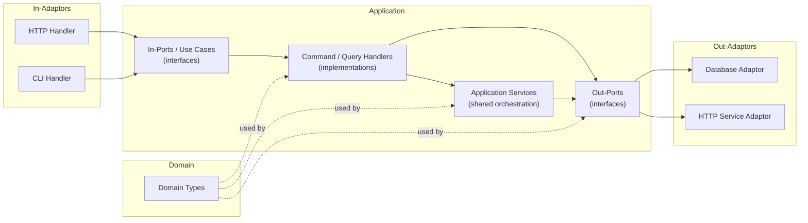
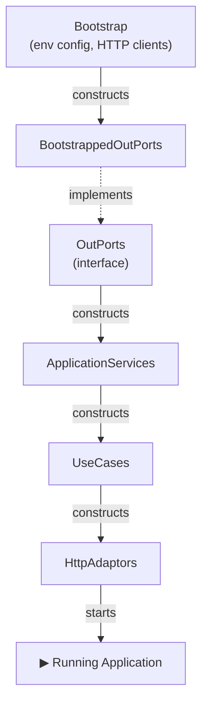
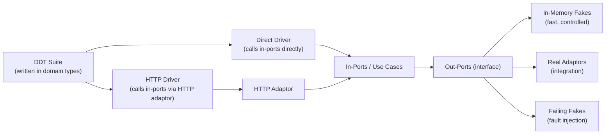
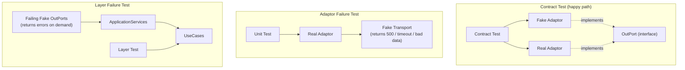

# An Approach to Architecting, Wiring and Testing a Clean Ports and Adaptors Web Application

This document offers an opinionated approach to a system architecture.

It is chiefly aimed at web applications, but the principles should be applicable to other types of systems.

It draws heavily from Ports and Adaptors architecture (aka Hexagonal Architecture) and Clean Architecture, as explained in the book [Getting Your Hands Dirty With Clean Architecure](https://learning.oreilly.com/api/v1/continue/9781805128373/). It departs from the book when we think it could be made more clear.

Familiarity with all of the above will be useful.

## Goals

- Overview of a Ports + Adaptors architecture
- Definition of terminology 
- Description of the organisation of the code in this architecture in the abstract
- Description of the organisation of the code in this architecture when initialising the application (wiring up)
- A testing strategy related to both

## Architecture

### Names
1. The architecture should be apparent from the code
2. Therefore, we should be able to see the parts of the architecture in the code.
3. This visibility should extend to the packages, the package names, the names of the objects, classes, interfaces, and also to how they all interact with each other.
4. Screaming Architecture. It should be _hard_ to misunderstand the architecture. Not only should the approach be documented, but the objects and their names should make it very apparent.
5. There is no reason not to name parts of the code after the terms in the ports and adaptors architecture.
6. Similarly for DDD.

#### Domain

The domain has no dependencies.

There are two schools of thought on where business logic lives in the domain:

**Anaemic domain** — domain types are plain data structures; all business logic lives in Application Services and Use Cases. Logic is easy to locate (it’s always in the use case layer), and this pairs naturally with CQRS. The downside: domain objects can’t protect their own invariants, so nothing stops you putting an object into an invalid state.

**Rich domain** — business logic lives inside the domain types themselves. Domain objects enforce their own invariants and are self-protecting. The upside is strong encapsulation; the downside is that logic is harder to locate and can become entangled with the domain’s data model, which can fight against the clean separation that CQRS wants.

For simple domains, anaemic is usually fine — the use cases are the right place for the logic. As the domain grows more complex, a richer domain model starts to pay for itself. This is a judgement call, not a rule.

#### Application
An application is application of the domain types to solve a business problem

If the whole application has an interface, it is the Use Cases. If that interface has an implementation, then it's the collection of Command and Query Handlers

An application is made up of

- the Out-Ports (interfaces)
- other Application Services
- the Use Cases (In-Ports) (interfaces)
- the Command and Query Handlers

All of them depend on the Domain.

Each of these will have access to and use types from the Domain.

The Application is the Domain “in action”, applied to solve a problem.

#### Application Service

An application service is an orchestration object: it coordinates domain logic and out-ports to perform a business activity. Use case implementations can (and often should) call out-ports directly: there's no requirement for an application service to exist. But when you see the same coordination logic repeated across multiple use cases, that's the signal to extract it into an application service.

#### Port

There are two kinds of port:

- **Out**-Port: a port that the application uses to communicate with an external service.
- **In**-Port: a port that other programs use to communicate with our service.

Ports are _abstract_. They are interfaces.

#### Use Case

A Use Case may be used interchangeably with an In-Port. I prefer this term, as it helps capture the idea that the In-Port should be doing something for a user.

That said, it is more important that we are naming things consistently.

#### Adaptor

An adaptor brings external things into the application, or brings the application to external things.

They are used with ports.

In-Ports work with adaptors. An In-Port is given by the Application to an HttpAdapter so that the application can be communicated with over HTTP.

An _http handler (adaptor)_ could wrap an in port. A _command line handler (adaptor)_ could wrap an in port.

Out-Ports work with adaptors. A database connection can be wrapped with an Adaptor. In this case, the Adaptor will implement the Out-Port interface.

A _database adaptor_ could implement the “Repository” out port. An _http adaptor_ could implement a “Service” out port.

“In adaptors” wrap In-Ports from the application, to present an external interface to the outside.

“Out adaptors” wrap an external interface from the outside, to present an Out-Port to the application.

#### Command / Query Handler

All Use Cases can be divided into two types: Command Handlers and Query Handlers.

Both of these are implementations of Use Cases.

One accepts commands. One responds to queries.

Queries return data, but have no side effects.

Commands have side effects, but do/should not return data.

Please read around [Command-Query Responsibility Segregation (CQRS)][https://martinfowler.com/bliki/CQRS.html] for more details.

Again, I repeat: it’s more important that there is consistency around this than perfection.

## Wiring Up and Starting Your Application

When we start our program, we create objects and then combine them in particular ways in order to produce the desired effects, both in terms of the business logic and how it communicates with the outside world.

This creation and combination is often called the 'wiring up’ of  the program. We will use this term.

Although in one way the Out-Ports are in the equivalent level of  abstraction as the Use Cases, in practice there is a dependency tree where the Use Cases depend on Application Services, which depend on the Out-Ports.

### Ordering

1. The implementations of the Out-Ports - the “out” _adaptors_ - are the _first_ things that your application must create.
2. This is because your application services and use cases will depend on these ports.
3. Ultimately your domain is made of “out” ports + business logic.
4. And so “out ports” must come first.

#### `Bootstrap`

1. There should be an object, that provides the dependencies used to construct the Out-Ports.
2. We shall call this Bootstrap.
3. Bootstrap provides configuration as environment variables i.e. db connection strings, Uris
4. It also provides HTTP clients to build the http adaptors of “out” ports.
5. What follows is a continuation of this pattern, where a single object handles the ‘wiring’ of a single layer.

#### The `OutPorts` Interface
1. To make the architecture apparent from the code, we should construct all our “out” ports at the same time, and then use them to construct our domain types.
2. To do so, we should have an interface that represents all of the out ports
3. It must be an interface, as all our our out ports are interfaces as we are using _dependency inversion_; the domain should not be aware of the implementations of the out ports.
4. This interface will expose all of the out ports to the next layer that is constructed: the domain.
5. The OutPorts interface must have at least _one_ implementation, which is constructed depending on the Bootstrap object. `BootstrappedOutPorts`. This “real” implementation will construct the out ports that the production application will use.
6. There may be more implementations - see testing later.

### The  `ApplicationServices` object

1. In the same way we build the OutPorts from Bootstrap, we build the concrete implementation of the `ApplicationServices` object from OutPorts.
2. ApplicationServices represents how all of the out ports are wired together in order to perform business activities that are shared between UseCases.
3. The `ApplicationServices` object should _not_ be an interface; there is never a need to provide an “alternative” set of business logic.
4. The `ApplicationServices` object presents _all_ of the objects that are needed to fulfil the UseCases (in ports).
5. If some UseCases depend directly on an OutPort - if there is no logic shared between UseCases for the orchestration of the OutPorts in some cases, then the OutPorts in question can be passed directly through with the application services.

### The `UseCases` object

1. In the same way we build the OutPorts from Bootstrap, and ApplicationServices from OutPorts, we build the `UseCases` object from the ApplicationServices object.
2. The `UseCases` object represents all of the Use Cases of the application.
3. A UseCase is another word for an “in” port
4. An implementation of a UseCase is a `CommandHandler` or a `QueryHandler`.
5. The `UseCases` object should _not_ be an interface. There should be only one way for the application to be used; the domain types should always be used in the same way in the use cases.
6. (The individual use cases should be interfaces, however, as dependency inversion)
7. This “layer” is properly called an Application, because it is the Application of the Domain model to solve a business problem.
8. The unification of all `UseCases` in a single interface is called a hub.
9. Therefore another way of structuring the `UseCases` object would be a `Hub` interface.

### The `HttpAdaptors` object 
1. In the same way we build the OutPorts from Bootstrap, and Domain from OutPorts, and the UseCases from the ApplicationServices, we build the HttpAdaptors from the UseCases.
2. In an HTTP application the HttpAdaptors are all HTTP adaptors that respond to an HTTP request with a response.
3. A router, a handler, controllers - these are the adaptors of the UseCases.
4. Again, the HttpAdaptors object should be concrete, and tied to how the application is presented to the user (HTTP, command line, desktop, embedded)
5. The HttpAdaptors should then be executed in a context - i.e. start listening for HTTP requests.
6. There should be a mapping of one UseCase to one HTTP route. Probably.

### Overview

1. Build the `Bootstrap` from nothing
2. Build the `OutPorts` from `Bootstrap` (as adaptors) (_application_)
3. Build the `ApplicationServices` from `OutPorts` (_application_)
4. Build the `UseCases` (the Application) from the `ApplicationServices` (_application_)
5. Build the `HttpAdaptors` or other adaptors (HTTP handlers) from the `UseCases`
6. Start the app

This same ordering will occur in both test and in production, _but may start and end at different points_.

I refer to each of these steps as _layers_ as in a layered architecture.

In this model, the domain underpins _everything_; objects and types of the Domain will be used at every layer.

## Testing
1. Testing is done in the context of ports and adaptors.
2. Testing of the application should ask two questions:
3. What do I need my out ports to be?
4. At what layer will I test?
5. Other questions will arise for testing of failure scenarios.

### What are my out ports?

1. In production, your out ports are generated from Bootstrap.
2. In test, in order to avoid starting the whole application, we can provide an object implements the OutPorts interface, but provides In Memory / Fake implementations of each of the out ports.
3. The behaviour of the real and fake implementations should be indistinguishable.
4. This is guaranteed by a contract test.
5. This “fake” OutPorts object can be used in the “production” Domain construction (as the domain should always be wired up the same way).
6. And so on, each layer wired the same way, but from a different (faster, easier to control), set of Out Ports.
7. This feature we can use when constructing Domain-Driven Tests

### Domain-Driven Tests (DDTs)

A DDT (Domain-Driven Test) is a test suite written against the in-ports of the application — the Use Cases — using domain types. It is, admittedly, a poor name. What it actually describes is closer to a mega-contract around the whole application: a suite that specifies the invariants of application behaviour, independent of how the application is driven and independent of what backs the out-ports.

The name reflects where the tests are *written from* (the domain boundary) not any particular testing philosophy.

#### Two axes of variation

If the wiring has been done well, the application can be tested across two independent axes:

**How you drive the in-ports:**
- Call the in-ports directly (no transport overhead)
- Call the in-ports through an in-adaptor — e.g. HTTP

**What the out-ports are:**
- In-memory fakes (fast, controlled)
- Real out-port implementations (integration)
- Failing fakes (fault injection)

These combine freely:

| Driver | Out-ports | What you're testing |
|---|---|---|
| Direct | In-memory fakes | Application logic, fast |
| HTTP adaptor | In-memory fakes | HTTP wiring + logic |
| Direct | Real out-ports | Logic + persistence integration |
| HTTP adaptor | Real out-ports | Full stack |
| Direct | Failing fakes | Failure handling |

The same test suite runs across all configurations. The tests don't change, _only what they're wired to_.

#### How DDTs are written

Tests are written using domain types, against the in-port interfaces directly. The "unwrapped" configuration calls the use case implementations directly. The "wrapped" configuration passes the same interactions through a transport adaptor (HTTP, for example) which converts them to requests and back.

This means the HTTP adaptor tests are not a separate suite asserting on JSON shapes and status codes. They are the *same* behavioural assertions, exercised through HTTP. If the adaptor is wired correctly, the suite passes. If it isn't, it fails in the same terms as the direct tests, the domain terms, not HTTP terms.

The confidence this gives is significant: the in-memory out-ports are trusted (by contract tests); the wiring is trusted (by the DDT suite in the direct configuration); the adaptors are trusted (by the DDT suite in the wrapped configuration). Each layer's correctness is verified by the same suite, not by separate, disconnected tests.

### Fault injection

The contract test guarantees happy-path behaviour only. How the application handles failures above the adaptor level is covered by DDTs with failing fake out-ports (see above). But there is one gap: you cannot reliably trigger failure states *inside* a real adaptor — you can't make your database return a connection error on demand (unless you have remote fault injection available, but that's another post).

To test the adaptor's own error-handling logic, inject a fake transport layer (a fake HTTP client, a fake DB driver) into the *real* adaptor implementation. This lets you assert on what the adaptor returns when it receives a 500, a timeout, or a malformed response — in isolation, without needing the real external system to misbehave.

