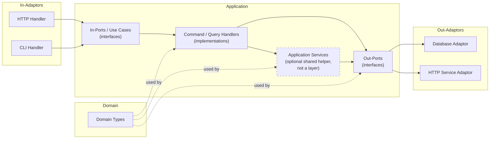

This is the companion to [In Defence of Architecture](/posts/2026/7/2/in-defence-of-architecture). That post argues _why_ you'd want this architecture - because it makes change easy. This one is the concrete version: the actual parts, named and defined, and how they fit together.

We'll go through the ports and adaptors architectural pattern now, and try to evaluate what it is about it that makes change easy, based upon the criteria we saw for how an architecture can help make changes easier.

After this, take a look at [the wiring](/posts/2026/7/3/wiring-up-a-ports-and-adaptors-application) post, and eventually the testing one.

### Names

The architecture should be apparent from the code. Not documented-in-a-wiki apparent, but _apparent from what you can see in front of you_. You should be able to open the source, look at the packages, the package names, the classes and interfaces, and see the shape of the whole thing and how the parts talk to each other. This is sometimes called [Screaming Architecture][screaming]: the code should shout what it is. It ought to be _hard_ to misunderstand.

(If you're in a city, you don't need a glossary to know you're in a residential street - you look, and it's a street with residences. And there might be street sign to really drive that home).

The easiest way to get there is to name the things after the role they play in the architecture. There is no prize for inventing your own vocabulary. If it's an out-port, call it an out-port. Same goes for the DDD terms. Consistency beats cleverness every time.

#### Domain

The domain has no dependencies. Nothing. It sits at the bottom and everything else is built on top of it.

There are two schools of thought about where the business logic for your application lives.

**Anaemic domain** - the domain types are plain data structures, and all the behaviour lives in the application services and use cases (we'll meet them soon). The logic is easy to find, because it's always in the same place: the use case layer. The cost is that your domain objects can't protect their own invariants: nothing stops you putting one into an invalid state.

**Rich domain** - the behaviour lives inside the domain types themselves. The objects enforce their own invariants and are self-protecting. You get strong encapsulation, but the logic is harder to locate, and more of your design effort goes into the model.

For a simple domain, anaemic is usually fine; the use cases are the right home for the logic. As the domain gets more complicated, a richer model starts to earn its keep. This is a judgement call, not a rule, and anyone who tells you otherwise is selling something. And of course, there's a lot of space between the two where you can do something in-between.

Whether you keep commands separate from queries is a _different_ question, orthogonal to this one - you can do it with either kind of domain, and doing it inside a rich model is more or less what CQRS is.[^cqs]

If you care deeply about this bit (and you should), read the Domain-Driven Design book(s), but for the purposes of this document it's a detail.

#### Application

An application is the domain types _applied_ to solve a business problem.

If the whole application has an interface, that interface is all of the use cases together. If that interface has an implementation, that implementation is the collection of all of the command and query handlers (they're on their way, promise).

An application is made up of:

- the out-ports (interfaces);
- application services (holding some of them together);
- the use cases, aka the in-ports (interfaces);
- and the command and query handlers.

All of them depend on the domain, and all of them use its types. The application is the domain in motion.

#### Port

There are two kinds of port:

- an **Out**-Port is how the application talks to an external service. Also called a "driven" port, because it's where our system makes something else _do something_ - the external thing is driven by us.
- an **In**-Port is how other programs talk to our service. Also called a "driving" port, because it's where other things make our system _do something_ - they're in the driving seat.

Ports are _abstract_. They are interfaces. That's the whole point of them.

#### Use Case

I use "use case" and "in-port" interchangeably, but I prefer use case, because it keeps you honest: an in-port should be doing something _for a user_. That said, pick one and stick to it - consistency matters more than my preference.

#### Adaptor

An adaptor brings the outside world into the application, or carries the application out to the outside world. Adaptors are always paired with ports.

On the "in" side, an adaptor wraps an in-port to present an external interface. The application hands an in-port to an HTTP adaptor so it can be spoken to over HTTP; a command-line handler could wrap the same in-port to let you drive it from a terminal.

On the "out" side, an adaptor implements an out-port. A database connection gets wrapped up as an adaptor that implements the `Repository` out-port; a call to some other service gets wrapped as an adaptor implementing a `Service` out-port.

So: **in-adaptors** wrap in-ports to face the world, and **out-adaptors** wrap the world to present an out-port to the application.

#### Command / Query Handler

Every use case is either a command handler or a query handler. Both are implementations of use cases; the difference is what they do.

A query returns data and has no side effects. A command has side effects and returns nothing. Drawing that line at the level of the use case is [Command-Query Separation](https://martinfowler.com/bliki/CommandQuerySeparation.html) - CQS - applied to whole handlers rather than to individual methods.[^cqs]

As before: being consistent about this matters more than getting it theoretically perfect.

#### Application Service

Sometimes the same coordination logic - the same little dance of domain types and out-ports - turns up in use case after use case. When it does, you pull it out into an _application service_ and share it.

That is all an application service is: a bit of shared behaviour lifted out of the use cases that need it. It is emphatically _not_ a layer, and it is _not_ a boundary. In proper DDD a use case _is_ an application service - a command or query handler is just an application service that happens to be an in-port - and I'm only giving the shared bits a name of their own so we remember what they're for.

Two rules keep them honest, and they matter more than they look:

- an application service is **never an interface**, and must **never be faked or mocked**. It is real, always, in every test. The only thing you ever fake is an out-port.
- use cases **never depend on each other**. If two use cases need the same logic, that logic goes into an application service that sits _below_ them. It does not turn one use case into a dependency of another.

A use case, confusingly, _is_ an interface - the in-port that its handler implements. That's not a contradiction with the rule above: an interface and a _fake boundary_ are two different things. The in-port is an interface you _drive from_ - you run the real thing behind it, you never fake it - while the out-port is the interface you _substitute_ a fake for. An application service is neither an interface nor a boundary. It's just shared guts.

You don't always need one. A use case can - and often should - just call the out-ports directly.

---

Put all of that together and the architecture looks like this:

If you've seen the standard hexagonal architecture picture before, this is that, but I've just drawn left-to-right and with the names I'm going to use for the rest of the post, and I've used Mermaid because I'm lazy.

## What makes change easy

That's the whole cast: the domain, the ports, the adaptors, the use cases and their handlers, and the occasional application service. Not many parts, all told - and each one has a single job and a name that says what that job is.

The naming is the point, and it pays off exactly where I promised it would back in [the argument](/posts/2026/7/2/in-defence-of-architecture): when you come to make a change, the code itself tells you where it goes. Get the names right and the architecture _screams_ - you open the source and the shape is just _there_, in the packages and the types, impossible to misread. Get the two edges right and they scream too: everything that touches the outside world is an adaptor, and it's obvious which of the two kinds it is.

So change is made easier because we can name all the parts, and each one has a part to play in the story of how the application works. And the parts don't interfere with each other; they can be reused, for sure, but they're not treading on each other's toes. They have _well defined_ responsibilities.

On top of this, we can see that if we keep following this pattern, we can just keep adding features and making changes in the same way, indefinitely, into the future. The pattern of the architecture can easily survive changes that extend it. So not only will we be making easy changes, we'll keep making easy changes.

The next thing I want to make _scream_ is the wiring - the way we build the whole system up from nothing, every time we build it and run it: the instructions for how to build the city. That's the next post: [Wiring Up a Ports and Adaptors Application](/posts/2026/7/3/wiring-up-a-ports-and-adaptors-application).

[screaming]: https://blog.cleancoder.com/uncle-bob/2011/09/30/Screaming-Architecture.html

[^cqs]: Two acronyms, easily confused. **CQS** (Command-Query Separation, Bertrand Meyer) is the rule that a thing either _changes_ state and returns nothing, or _reports_ state and changes nothing - never both. **CQRS** (Command-Query Responsibility Segregation, Greg Young) takes that same split and pushes it much further down, into the model itself: a separate write model for the commands and a read model for the queries, sometimes with separate data stores behind them. What I'm describing here is the modest version - CQS drawn at the use-case boundary, so each handler is purely one or purely the other. If you wanted to, you could push that separation all the way down into the domain and end up with something much closer to full CQRS. It's the same idea, just taken further - and a much bigger commitment than this document needs.
