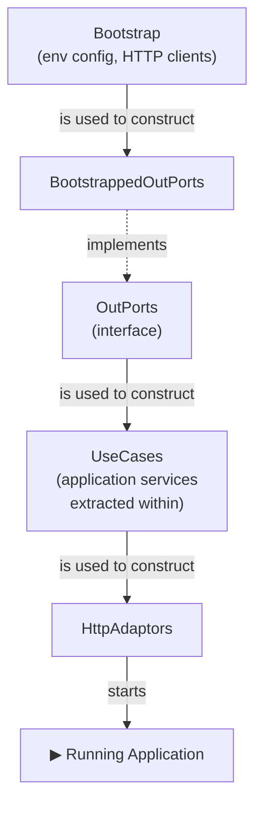

_**Dave Does Architecture** - a series:_

1. [In Defence of Architecture](/posts/2026/7/2/in-defence-of-architecture/)
2. [The Parts of a Ports and Adaptors Application](/posts/2026/7/3/the-parts-of-a-ports-and-adaptors-application/)
3. **Wiring Up a Ports and Adaptors Application** - _you are here_
4. How Do You Test a Ports and Adaptors Application? _(coming soon)_
5. Where Does Authentication Go? _(coming soon)_

---

This is a part of my series on architecture - part three I think - and it assumes that we've seen [the "parts" of a ports and adaptors architecture](/posts/2026/7/3/the-parts-of-a-ports-and-adaptors-application/) already: the domain, the ports, the use cases, the adaptors. If those are unfamiliar, start there.

We've seen [why architecture is a good thing](/posts/2026/7/2/in-defence-of-architecture/), and we've seen what a ports and adaptors architecture looks like when it's all running. But this bit is about _building_ that architecture up from nothing - the thing that happens every time we start the program.

When you start a program you create a pile of objects and then combine them in particular ways to get the effects you want, both the business logic and the way it talks to the outside world. This creating-and-combining is usually called _wiring up_, and that's what I'm going to call it too. 

But this is the thing the architecture picture doesn't show. On paper, on that ubiquitous hexagon picture, the out-ports and the in-ports sit at the same level of abstraction. And they _do_ - when the whole program is running. But in practice there's a dependency ordering between them: the in-ports depend on the out-ports. And that tree dictates the order you have to build things in.

And this is one of the places where it can all go a bit wrong.

I've seen a lot of lip-service paid to ports and adaptors, and also a lot of honest attempts at it. People nod at the picture, note it in the architectural decision record, name things "ports" and "adaptors" in the code. But then someone has to actually _build_ the architecture - construct the objects, connect them together, set it running - and that is where the discipline can quietly fall apart. A dependency gets `new`ed up in the middle of a handler because it was easier than threading it through. The construction of a single object ends up smeared across a dozen files. A use case reaches sideways into another use case. None of it shows up in the architecture diagram, which still looks lovely - it shows up six months later, when a change that should have taken an afternoon takes a fortnight.

I find this happens because nobody tries to structure the building in the same way they structure what's been built. Often a huge wobbly file with _all_ the objects in, being constructed in no particular order. And that's a best case scenario - the worst case is when that construction is spread out in some way that some bright spark thought would be useful at the time - building all the parts for one use case _here_ and then the others over _there_, putting all the objects that are called "repository" or all the ones that have a 'Y' in them, over in this folder\. The sort of ad-hoc categorization that I mentioned in the first post.

The architecture usually doesn't begin to rot in the design. It starts in the small sins committed in the wiring. So this is the part where I'm going to be most opinionated, because this is a good place to start defending our architecture from entropy by preserving the design.

### Ordering

The out-adaptors - the concrete implementations of the out-ports - are the _first_ things your application has to create. Everything else leans on them: the application services and use cases all depend on the out-ports, and ultimately your domain in action is just out-ports plus business logic. So the out-ports come first, and we work our way up from there. They are the rock upon which you will build your church, they are the place you will stand to move the world.

We are going to call each part of this "building-up" from the out-ports a _layer_, in honour and reference to layered architecture, and also because that's really what's happening: we're building our ports-and-adaptors application in layers. Because it's easy to think about it in that way, and harder to mess up, and harder to start leaking things between the layers if you can actually see the bloody layers.

What follows is a single idea applied over and over: an object is responsible for building the objects in a single layer, and it builds that layer by wiring together the objects of the layer below.

And to stop us from getting lost, we'll bundle together all the objects of each layer into a single fat object and pass that around (instead of having a method call with like xity billion arguments).

#### `Bootstrap`

At the very bottom you need something to provide the raw materials for the out-ports. Call it `Bootstrap`.

`Bootstrap` reads the configuration - the environment variables, the database connection strings, the URIs - and hands out the HTTP clients you'll need to build the out-adaptors. It's the one and only place that touches the messy outside-configuration world, so the rest of the wiring doesn't have to.

#### The `OutPorts` Interface

We want to build all the out-ports together, in one place, and then hand them to the layer above. So we give them a home: an `OutPorts` interface that exposes every out-port the application has.

It has to be an interface, because every out-port is an interface - that's dependency inversion at work, and it's why the domain never has to know what's actually implementing its out-ports. `OutPorts` needs _at least_ one real implementation, built up from the `Bootstrap` components - let's call it `BootstrappedOutPorts` - which constructs the out-ports the real life production application runs on. There may be others - there _will_ be others - but we'll get to them when we talk about testing.

#### The `UseCases` /  `Application` object

Same move again: we build `UseCases` from `OutPorts`. This object represents every use case the application has, and a use case, remember, is just an in-port. Its implementation is a `CommandHandler` or a `QueryHandler`.

You might have expected an `ApplicationServices` layer to appear here, in between. It doesn't. Application services aren't a layer - they're the shared bits of logic we lift out of the use cases, and they get constructed _in this same step_, from the out-ports, and handed to whichever use cases need them. They sit below the use cases, not between them and the out-ports. Wiring them as their own rung is exactly the mistake that leads someone to think they can be swapped, or faked, or mocked.

The collection of all the use cases here - the `UseCases` object - is _not_ an interface. There should be exactly _one_ way for the application to be wired together - the domain types are always used the same way, the out-ports are always wired up in the same way - so there's nothing to abstract over. (The individual use cases _are_ interfaces, mind you, so the concrete `UseCases` object has a collection of fields on it, each of which is a particular `UseCase` - which is an interface.)

This layer could properly be called the `Application`, because it's where the domain model is actually applied to solve the business problem. If you gather all the use cases like this, I'd recommend calling it the `Application`. It makes it nice to talk about, and nice to work with.[^hub] 

#### The `Adaptors` (`HttpAdaptors`) object

And once more, from the top: we build an `HttpAdaptors` object from the `UseCases` object. In an HTTP application these are the adaptors that turn a request into a response - the router, the handlers, the controllers. They're the in-adaptors of the use cases (in-ports).

Like the layer below, this object is concrete, but now each of the fields is a concrete adaptor for a `UseCase` - they're all _real_ adaptors, tied to _how_ the application faces the world. HTTP most commonly for me, but it could just as well be a command line, a desktop UI, or something embedded. The rule of thumb is one use case to one adaptor.

Bundling this all up - here I'll lean in to the HTTP adaptors - if we collect all of the adaptors behind an HTTP router to make sure that each is being called based on the path information in the HTTP request etc, then the final interface we have is very simple:

```
Request -> Response
```

Once we've got this, we can set it running in a context - for HTTP, that's the internet, so we start listening for those requests on a port - and the application is alive.

### Overview

So the whole startup, from nothing to running, is:

1. Build `Bootstrap` from nothing.
2. Build `OutPorts` from `Bootstrap` (as out-adaptors).
3. Build `UseCases` - the Application - from `OutPorts` (extracting any shared logic into application services as you go).
4. Build `HttpAdaptors` (or whatever other in-adaptors) from `UseCases`.
5. Start the app.



This same ordering happens whether you're starting the real thing or standing up a slice of it - and a slice can start and stop at different points along the chain. That flexibility is where a lot of the value hides - enough that it gets [its own post](/drafts/how-do-you-test-a-ports-and-adaptors-application/).

To reiterate: I call each of these steps a _layer_, in the layered-architecture sense. And underneath all of them sits the domain: its types are used at every single layer.

#### Where does this code live?

Each of those "build the next layer from this one" steps is a function or a constructor, and it's worth being clear about where those functions belong - because it isn't where you might first reach for.

They are not part of the application, and they are certainly not part of the domain. A function that takes `OutPorts` and hands you back `UseCases` is _wiring_ - it's infrastructure, the same species of code as the thing that reads your config, the thing that builds `Bootstrap`, and the thing that opens a socket and starts the server listening. So that's where it lives: in the same packages, the same folders, as the rest of your infrastructure. Right at the edge, next to `main`.

This matters because it keeps the temptation out of the domain. The domain and the application never construct their own dependencies; they're _given_ them. The knowledge of how everything is assembled lives in exactly one place, out at the edge, and the inner layers stay blissfully ignorant of it. If you ever find a wiring function reaching into the domain package, something has gone wrong.

## So why be this fussy?

All of this - the strict order, the objects representing the dependencies for a layer, the one and only one place where each thing gets constructed and wired together - is a lot of ceremony for something as dull as the wiring. So why do I care?

Because the wiring is one place that can quietly undo the whole architecture. The design is just a picture of what things _should_ look like when it's all built, and if the building is sloppy - dependencies conjured mid-handler, construction smeared everywhere, layers leaking into each other - then the lovely architecture will quickly become a lie. You won't notice for a while, but you'll certainly notice it the day a simple change starts to become hard.

Doing it in this structured and disciplined way makes it harder to make mistakes that distort the architectural pattern. I say _harder_, because it's always possible to make a mess of things. It's software development! But if you make the code _scream_ at you how the dependencies stack up and are wired together, then you've got more chance of getting the benefits of the screaming architecture I mentioned up front: easier to see where the change goes, easier to maintain the architectural pattern, which makes it easier to change and easier to keep changing.

[^hub]: I've seen it called a `Hub` before in some situations - you can picture it as the bit in the middle of the hexagon where the individual use cases form the spokes of a wheel - but I think this muddies things too much with a new word.
